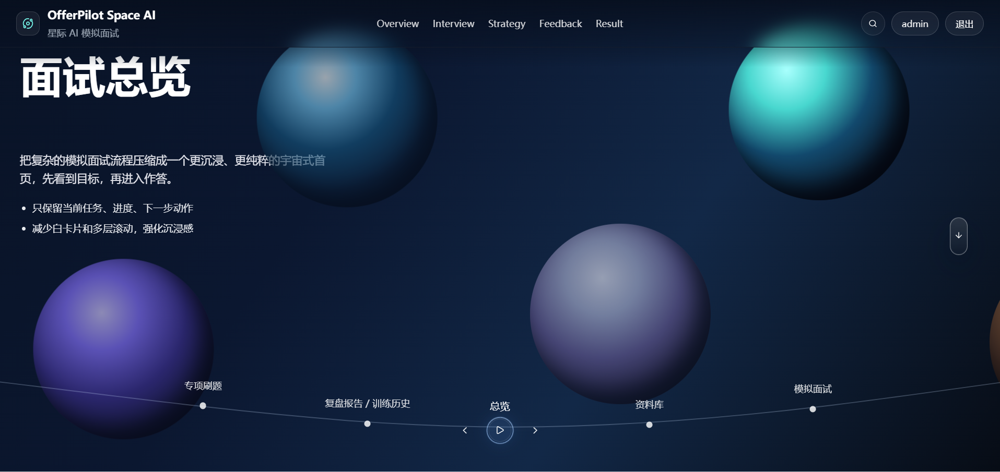
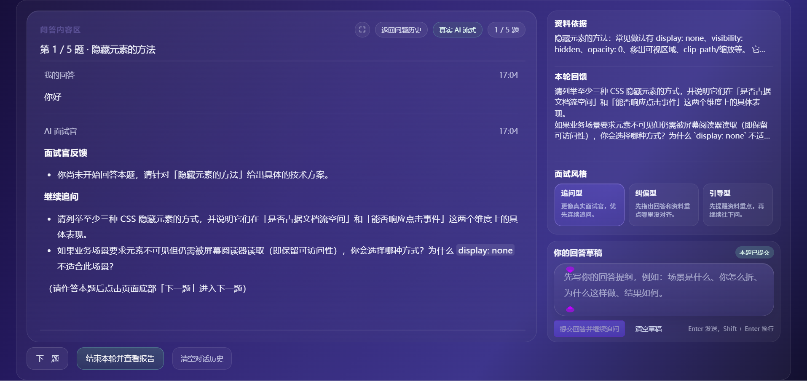
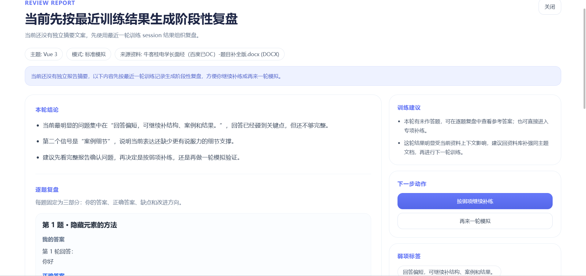
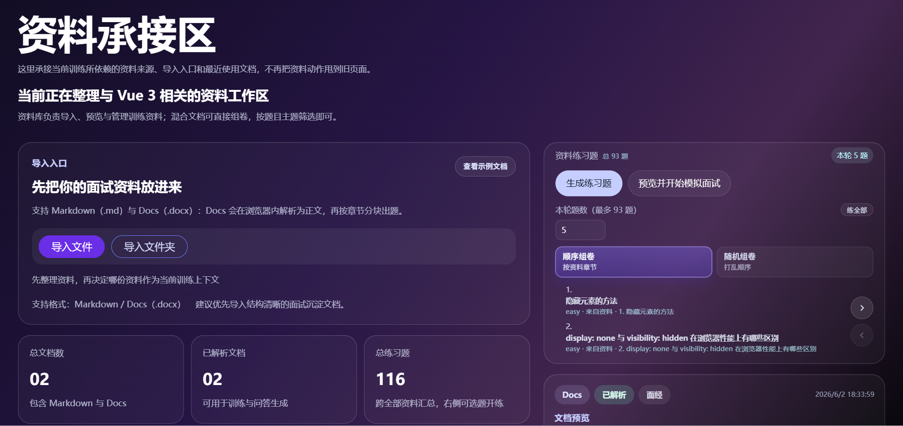
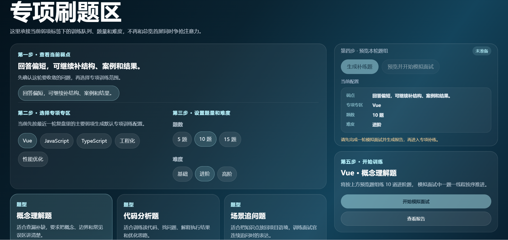

<p align="center">
  
</p>

<h1 align="center">OfferPilot-Space-AI</h1>

<p align="center">
  面向模拟面试与求职训练的前端原型，项目采用宇宙风格，整体围绕资料库页、总览页、模拟面试页、专项刷题、复盘报告构建。
</p>

<p align="center">
  <a href="https://fjj187.github.io/OfferPilot-Space-AI">在线预览</a>
  ·
  <a href="https://github.com/fjj187/OfferPilot-Space-AI">项目主页</a>
</p>

<p align="center">
  
  
  
  
  
</p>

> 这是一个以模拟面试为主线的单页应用。
> 重点不是通用聊天，而是把面试发起、专项训练、报告复盘和历史记录串成一条完整链路。

## 亮点

* 宇宙模拟面试页把面试流程、场景切换和视觉叙事放在同一屏。
* 工作台提供总览、资料库、模拟面试、专项刷题、复盘报告和历史记录入口。
* 面试流式输出使用 SSE（服务端发送事件）实现，支持连续生成和中止控制。
* 报告与内容预览支持 Markdown（标记语言）、Mermaid（流程图工具）和 LaTeX（排版系统）
* 题库与复盘链路已打通，可围绕薄弱项生成专项训练与报告参考内容。
* 路由兼容 hash（哈希路由）与 history（历史路由）两种模式，适配 GitHub Pages（GitHub 页面部署）。

## 快速入口

* 在线预览：`https://fjj187.github.io/OfferPilot-Space-AI`
* 本地开发：`pnpm dev`
* 宇宙页入口：`/showcase/mock-interview-space`
## 运行截图

<p align="center">
  
</p>

<p align="center">
  
</p>

<p align="center">
  
</p>

<p align="center">
  
</p>

<p align="center">
  
</p>

## 接入示例

这个项目对使用者来说，最重要的就是两步：先配置环境变量，再启动前后端服务。配置好后，就可以直接进入模拟面试对话。

### 1. 配置环境变量

先复制模板文件，再填写自己的密钥和本地后端地址。

```bash
cp frontend/.env.template frontend/.env
```

```env
VITE_INTERVIEW_BACKEND_ORIGIN=http://localhost:3030
VITE_INTERVIEW_SSE_URL=
VITE_SPARK_KEY=你的_星火_API_Key
VITE_SILICONFLOW_KEY=你的_SiliconFlow_API_Key
VITE_MOONSHOT_KEY=你的_Moonshot_API_Key
VITE_DEEPSEEK_KEY=你的_DeepSeek_API_Key
```

`VITE_INTERVIEW_BACKEND_ORIGIN` 默认指向本地 `3030` 端口，前端开发服务器会通过 `Vite` 代理到后端。

### 2. 启动后端

```bash
pnpm dev:backend
```

后端启动后，默认监听 `http://localhost:3030`。

### 3. 启动前端

```bash
pnpm dev
```

前端启动后，默认访问 http://localhost:2048/#/showcase/mock-interview-space（模拟面试空间页面路径），进入后即可开始模拟面试对话。

### 4. 接口说明

* 面试流式接口默认走 /api/interview/stream（面试流式接口）
* 会话列表和复盘报告默认走 /api/interview（面试会话与复盘接口）
* 如果你有独立后端，可以直接修改 frontend/.env（前端环境配置文件） 里的 VITE_INTERVIEW_SSE_URL（面试流式地址配置项） 和 VITE_INTERVIEW_BACKEND_ORIGIN（后端源地址配置项）

### 5. 可选模型密钥

如果你要启用模型适配，再补这几个密钥就行，不影响主流程：

* `VITE_DEEPSEEK_KEY`
* `VITE_SPARK_KEY`
* `VITE_SILICONFLOW_KEY`
* `VITE_MOONSHOT_KEY`

## 相关文档

* `docs/项目整理方向.md`
