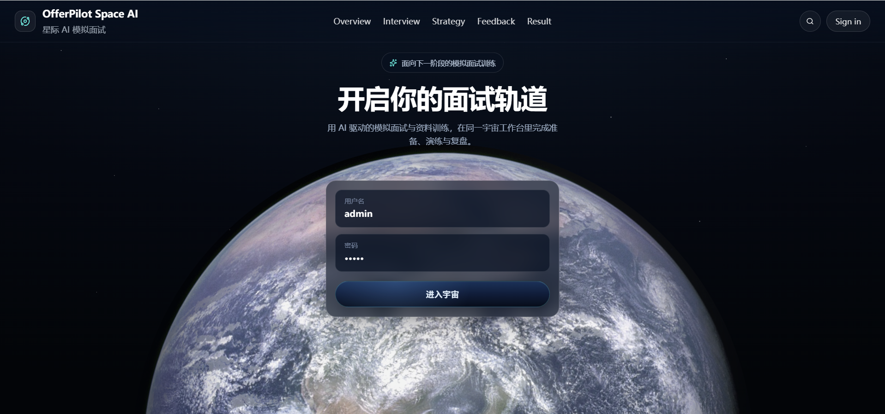
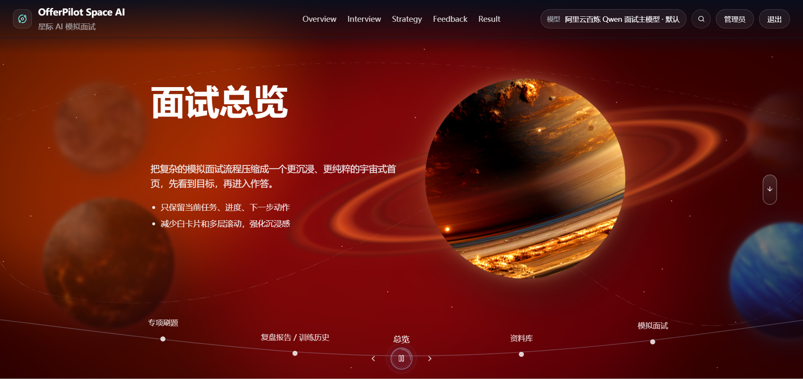
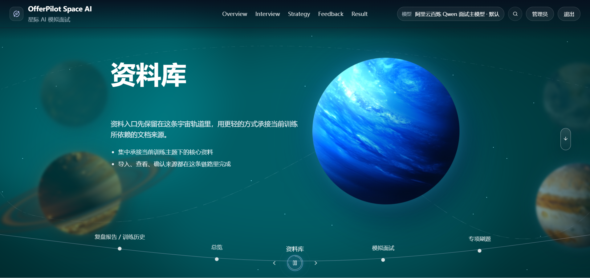
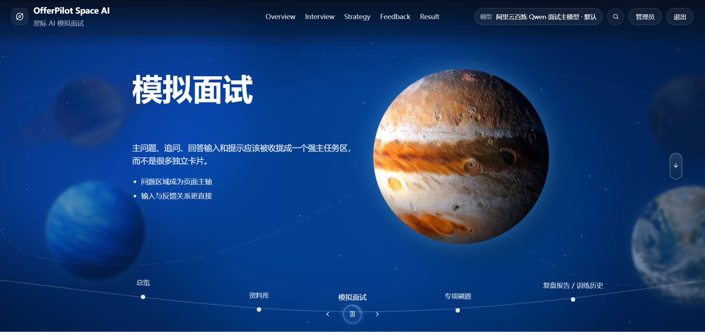
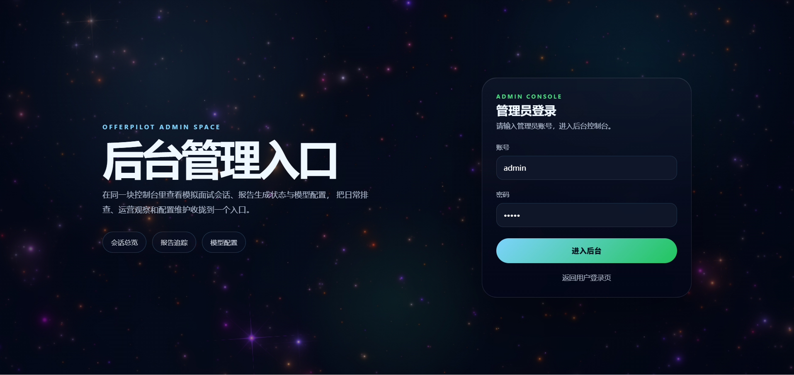

<p align="center">
  
</p>

<h1 align="center">OfferPilot-Space-AI</h1>

<p align="center">
  面向模拟面试与求职训练的前端原型，项目采用宇宙风格，围绕资料库、总览页、模拟面试、专项刷题、复盘报告、ECharts（图表库）可视化数据大屏与后台管理面板构建完整训练闭环。
</p>

<p align="center">
  <a href="https://fjj187.github.io/OfferPilot-Space-AI">在线预览</a>
  ·
  <a href="https://github.com/fjj187/OfferPilot-Space-AI">项目主页</a>
</p>

<p align="center">
  
  
  
  
  
</p>

> 这是一个以模拟面试为主线的单页应用。
> 重点不是通用聊天，而是把面试发起、专项训练、报告复盘和历史记录串成一条完整链路。

## 亮点

* 宇宙模拟面试页把面试流程、场景切换和视觉叙事放在同一屏。
* 工作台提供总览、资料库、模拟面试、专项刷题、复盘报告和历史记录入口。
* 基于 ECharts（图表库）构建训练数据可视化大屏，可展示核心指标、能力雷达、评分趋势和训练分布。
* 后台管理面板支持从运营视角查看训练表现、模块状态和关键数据概览。
* 面试流式输出使用 SSE（服务端发送事件）实现，支持连续生成和中止控制。
* 报告与内容预览支持 Markdown（标记语言）、Mermaid（流程图工具）和 LaTeX（排版系统）
* 题库与复盘链路已打通，可围绕薄弱项生成专项训练与报告参考内容。
* 路由兼容 hash（哈希路由）与 history（历史路由）两种模式，适配 GitHub Pages（GitHub 页面部署）。

## 快速入口

* 在线预览：`https://fjj187.github.io/OfferPilot-Space-AI`
* 本地开发：`pnpm dev`（一键启动前端服务与后端服务）
* 宇宙页入口：`/showcase/mock-interview-space`

## 功能概览

* 模拟面试空间聚合题目发起、过程交互、流式输出和结果沉淀。
* 训练数据大屏基于 ECharts（图表库）统一呈现训练指标、能力维度和趋势变化。
* 后台管理面板用于承接运营查看、内容管理和关键状态总览。
* 复盘报告链路支持从面试结果回流到专项训练与资料整理。

## 运行截图

<p align="center">
  
</p>

<p align="center">
  
</p>

<p align="center">
  
</p>

<p align="center">
  
</p>

## 可视化数据大屏

项目内置面试训练分析视图，围绕训练次数、能力雷达、训练主题分布、专项题型分布和趋势变化构建统一可视化表达，适合展示个人复盘结果，也适合作为运营侧数据看板的基础能力。

## 后台管理面板

除训练主链路外，项目也包含后台管理面板方向，用于承接内容配置、训练概览、数据追踪与后续扩展，便于把面试训练、题库管理和结果复盘放到同一套系统里管理。

## 接入示例

项目推荐通过后台管理面板完成模型配置。启动服务后，用 `admin（管理员账户）` 登录后台，在模型管理页面填入对应配置即可。

### 1. 启动本地服务

```bash
pnpm dev
```

`pnpm dev`（开发启动命令）会同时启动前端服务和后端服务：

* 前端默认访问：`http://localhost:2048/`
* 后端默认监听：`http://localhost:3030`

如果只需要单独调试某一侧，也可以使用：

```bash
pnpm dev:frontend
pnpm dev:backend
```

### 2. 使用 `admin（管理员账户）` 登录后台

进入后台管理面板后，使用 `admin（管理员账户）` 登录系统，进入模型管理页面。

### 3. 在模型管理页面填写自己的模型配置

在后台模型管理页按实际使用的模型服务填写对应内容即可，常见包括：

* `API Key（接口密钥）`
* `Base URL（服务地址）`
* `Model Name（模型名称）`
* 其他平台要求的附加参数

保存后即可在前台面试、专项训练或相关能力模块中直接使用，无需再回到代码里修改环境变量。

### 4. 使用说明

* 模型管理适合集中维护不同平台的模型配置。
* 如果后续需要更换模型，只需要在后台管理面板更新对应配置。
* 前台训练链路会直接读取已保存的模型配置，不需要重新改 `frontend/.env（前端环境变量文件）`。

## 相关文档

* `docs/项目整理方向.md`
