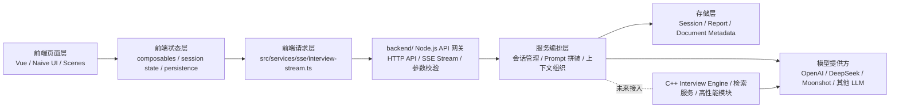

# 27. mock-interview-space 前端主导开发、Node 后端过渡与 C++ 扩展规划

## 0. 当前收尾状态说明

这份文档原本是一份“阶段规划文档”。截至当前版本，`27` 阶段内最关键的最小闭环已经落地，因此这里补一段收尾说明，明确哪些内容已经完成，哪些内容刻意不在 `27` 内继续扩张。

### 当前已完成的 `27` 范围成果

1. 仓库根目录已新增 `backend/`，并可独立启动。
2. `POST /api/interview/stream` 已跑通真实 SSE 请求链路。
3. 后端已支持 `mock` / `remote` provider。
4. 前端已支持 `stop / retry / error`，真实流式状态链路可用。
5. 后端已支持最小 session / message 文件持久化。
6. 后端已补齐：
   - `GET /api/interview/sessions`
   - `GET /api/interview/sessions/:sessionId/:threadId`
7. 历史页与报告页已经优先消费后端真实会话数据，并保留本地 fallback。

### 当前刻意停在 `27` 边界外的事项

以下内容不再继续塞进 `27`，而是归入下一阶段：

1. 后端正式生成结构化报告 summary。
2. 报告列表完全改为后端主导。
3. 数据库存储替代本地 JSON。
4. 用户系统、权限、分页、检索、复杂治理。

因此，`27` 的收尾定义可以明确为：

`项目已从前端单体 mock 演示，推进到“前端主导 + Node 最小后端 + 真实流式链路 + 最小会话读写闭环”的可演示、可联调状态。`

## 文档目的

这份文档用于把当前项目的真实推进方式讲清楚，避免后续开发目标过于理想化。

当前阶段的真实前提是：

1. 六月份之前，项目基本由前端单人推进。
2. 前端主链路、状态机、页面交互需要先由当前开发者完成。
3. 后端能力不能等未来同学加入后再开始，因此需要先在当前仓库内用 Node.js 提供最小服务。
4. 未来如果有 C++ 后端同学加入，不应推翻当前成果，而应在稳定协议基础上扩展或替换后端内部实现。

因此，本规划不再采用“前后端并行协作”的理想化假设，而采用以下主线：

`六月前由前端主导完成可演示、可联调、可替换后端的版本；后端先用 Node.js 落地最小服务，未来 C++ 同学在不破坏协议的前提下接管或扩展核心服务能力。`

---

## 一、当前项目现状

### 1. 当前已经具备的能力

当前仓库本质上仍然是一个前端项目，已经具备以下基础：

1. `mock-interview-space` 的页面结构与场景切换。
2. 资料库、模拟面试、专项刷题、报告页之间的前端状态流转。
3. 面试题线程、历史预览、报告摘要等前端状态管理。
4. 本地 mock 数据驱动的模拟面试流程。
5. 前端侧的 SSE/流式交互封装骨架。
6. 部分关键状态已开始有回归测试保护。

### 2. 当前还没有的能力

当前项目仍然缺少真正可用的服务端能力：

1. 没有可运行的自建后端目录和服务。
2. 没有真正的面试流式接口。
3. 没有服务端会话存储。
4. 没有真实的资料上下文拼装与模型调用链路。
5. 没有冻结好的前后端接口契约。

### 3. 当前的本质阶段

当前阶段可以定义为：

`前端交互与状态机已基本成型，但真实服务端链路尚未建立。`

因此接下来最重要的事情不是继续打磨 mock 风格细节，而是：

`先由前端主导完成完整主流程，并在仓库内建立最小 Node.js 后端，为未来 C++ 接入预留扩展位。`

---

## 二、阶段策略总览

为了符合真实资源情况，项目接下来按两个阶段推进。

### 阶段 A：六月前

由当前开发者主导，完成以下目标：

1. 前端主流程基本完成。
2. `mock-interview-space` 的真实流式请求链路打通。
3. 当前仓库内新增 `backend/` 目录。
4. 后端先使用 Node.js 提供最小 API 服务。
5. 前后端协议冻结。
6. 为未来 C++ 服务接入保留 provider 扩展层。

### 阶段 B：六月后

如果有 C++ 后端同学加入，则目标变为：

1. 接入或重构更稳定的后端服务能力。
2. 在不破坏前端协议的前提下替换高负载模块。
3. 补齐会话持久化、资料处理、检索和更高性能服务能力。

---

## 三、推荐的项目结构调整

既然当前决定直接在原项目里开发后端，建议在仓库根目录新增 `backend/` 文件夹，并明确它在六月前的定位是：

`Node.js API 网关与最小服务实现。`

推荐目录结构如下：

```text
chatgpt-vue3-light-mvp-main/
├─ src/                         # 前端源码
├─ public/
├─ docs/
├─ backend/                     # 新增：Node.js 后端目录
│  ├─ README.md
│  ├─ package.json
│  ├─ src/
│  │  ├─ app.ts
│  │  ├─ routes/                # API 路由
│  │  ├─ controllers/           # HTTP / SSE 控制层
│  │  ├─ services/              # 面试服务编排
│  │  ├─ providers/             # 模型 / 引擎提供方适配层
│  │  │  ├─ llm-provider.ts
│  │  │  ├─ mock-provider.ts
│  │  │  ├─ remote-llm-provider.ts
│  │  │  └─ cpp-engine-provider.ts   # 未来预留
│  │  ├─ storage/               # session / report / document 存储层
│  │  ├─ types/
│  │  └─ utils/
│  └─ .env.example
├─ package.json
└─ vite.config.ts
```

这套结构的核心不是“现在就做复杂后端”，而是提前把扩展位留出来。

---

## 四、推荐的兼容架构

当前最推荐的兼容方案不是“Node 和 C++ 二选一”，而是：

`前端始终只对接统一 API 协议；六月前由 Node.js backend/ 提供 API 网关；六月后如有需要，由 C++ 服务接入 Node 网关后方或逐步替换内部实现。`

架构图如下：



### 为什么推荐这个方案

1. 前端永远只依赖协议，不依赖后端语言。
2. 你现在就可以先用 Node.js 做通最小服务。
3. 未来 C++ 同学加入后，不需要前端大改。
4. 高性能或复杂模块可以逐步迁到 C++，而不是推翻整套系统。

---

## 五、最重要的原则：前端兼容的不是语言，而是协议

未来不管后端是 Node.js 还是 C++，前端都不应该关心后端内部语言实现。

前端真正需要依赖并稳定下来的只有四类东西：

1. HTTP 路径
2. 请求体结构
3. SSE 事件结构
4. 错误响应结构

因此本项目下一阶段必须先冻结协议，而不是先纠结最终后端语言。

---

## 六、前后端职责划分

为了符合当前阶段的现实情况，这里将职责拆成“当前职责”和“未来职责”。

## 6.1 当前阶段职责（六月前）

### 当前前端职责

当前阶段前端不仅负责页面，还需要主导整个产品闭环。

前端应负责的板块：

1. 场景页与组件交互
   - 资料库场景
   - 模拟面试场景
   - 专项刷题场景
   - 报告场景

2. 面试状态机
   - 当前题目线程
   - 作答进度
   - 风格切换
   - 历史预览
   - 报告跳转

3. 请求契约定义
   - 请求字段
   - SSE 事件字段
   - 错误响应格式

4. 前端请求层
   - mock / real 双链路切换
   - stop / retry / error 状态处理
   - 流式渲染

5. 联调保障
   - 关键回归测试
   - 错误提示
   - 本地 fallback

### 当前后端职责

六月前的后端应被视为“由当前开发者用 Node.js 提供的最小服务层”。

当前后端应负责的板块：

1. 提供最小 API 路由
2. 提供最小 SSE 流式接口
3. 转发或封装真实模型调用
4. 做最基础的 session / message 存储
5. 提供 provider 扩展层，为未来 C++ 留位

### 当前阶段不应追求的东西

1. 复杂用户系统
2. 完整权限系统
3. 多租户
4. 向量数据库
5. 完整 RAG
6. 自动题目编排引擎

---

## 6.2 未来阶段职责（六月后）

如果未来有 C++ 后端同学加入，他应主要接手服务能力，而不是前端页面。

### 未来 C++ 后端职责

1. 接入或重构高性能服务模块
2. 提升 SSE 稳定性和并发能力
3. 承担复杂推理编排逻辑
4. 实现资料解析、切片、检索等能力
5. 改善会话存储、日志、监控和部署能力
6. 在不破坏前端协议的前提下，替换高成本 Node 实现

### 未来前端职责

1. 继续维护场景交互与状态机
2. 继续消费既有 API 协议
3. 不因后端实现语言变化而大规模重写

---

## 七、建议冻结的接口契约

本阶段建议由前端先定义协议，Node 后端先实现，未来 C++ 后端继续遵守。

### 7.1 面试流式接口

建议接口：

`POST /api/interview/stream`

请求体建议：

```ts
interface InterviewStreamRequest {
  sessionId: string
  threadId: string
  topic: string
  questionTitle: string
  questionPrompt: string
  answer: string
  feedbackStyle: 'followup' | 'corrective' | 'guided'
  sourceDocumentName?: string
  sourceDocumentSummary?: string
  sourceDocumentTags?: string[]
  sourceDocumentExcerpt?: string
  sourceContext?: string
}
```

SSE 响应建议：

```ts
type InterviewStreamEvent =
  | { type: 'chunk'; content: string }
  | { type: 'done' }
  | { type: 'error'; message: string }
```

错误响应建议：

```ts
interface ApiError {
  code: string
  message: string
}
```

### 7.2 为什么本阶段仍然建议由前端控制“下一题”

当前前端已经实现了题目线程和题目切换逻辑，因此本阶段建议：

1. 后端只返回当前题反馈。
2. 前端自己决定何时切到下一题。
3. 后端暂时不要直接主导题组推进。

这样能降低首轮后端复杂度，也更适合单人推进。

---

## 八、六月前的开发目标

六月前的目标不应定义成“完整前后端平台”，而应定义成：

`前端主导完成完整面试主流程，Node.js backend/ 提供最小服务闭环，整个项目达到可演示、可联调、可替换后端的状态。`

### 8.1 六月前前端目标

前端应完成以下主成果：

1. 完整的模拟面试主流程
2. 题目线程切换与历史恢复
3. 风格切换状态稳定
4. 报告与历史链路基本完成
5. 真实流式请求接入能力
6. mock / real 双链路切换
7. 关键状态回归测试

### 8.2 六月前 Node 后端目标

当前后端只做最小可用版本：

1. 建立 `backend/` 目录
2. 跑通一个可启动的 Node.js 服务
3. 提供 `POST /api/interview/stream`
4. 支持 SSE 输出
5. 对接一个真实模型提供方
6. 保存最基础的 session / message 数据
7. 提供 provider 接口，未来允许接入 C++ 服务

### 8.3 六月前最值得优先实现的成果

优先级建议如下：

1. 真实面试流式接口
2. 前端接入真实流并正确渲染
3. 题目线程与风格状态稳定
4. 报告页对真实链路兼容
5. 最小后端存储

---

## 九、六月后的扩展目标

六月后如果有 C++ 后端加入，建议其目标是“增强能力”，而不是“推翻重来”。

### 9.1 可交给 C++ 的扩展板块

1. 更稳定的流式引擎
2. 更高性能的推理调度
3. 文档解析服务
4. 检索与召回服务
5. 更可靠的持久化
6. 高并发和超时控制

### 9.2 推荐的接入方式

推荐方案：

`Node.js backend/ 继续作为 API 网关，C++ 服务作为内部 provider 或内部服务接入。`

这样做的好处：

1. 前端无感知
2. 协议保持不变
3. C++ 同学可以专注服务能力
4. 迁移成本最低

---

## 十、当前前端应该负责的板块

由于六月前几乎只有前端开发者在推进，因此前端需要主动承担更多板块。

### 必做板块

1. `mock-interview-space` 页面与状态机完善
2. `src/services/sse` 请求层抽象
3. 接口契约定义
4. 联调异常处理
5. 历史、报告、题组一致性维护
6. 自动化测试保护

### 可做但要控制范围的板块

1. 后端最小 Node 服务
2. 本地简单 JSON / 文件级存储
3. 简单模型转发

### 当前不建议深挖的板块

1. mock 风格细腻调优
2. 复杂后端工程化
3. 复杂权限系统
4. 高级检索系统

---

## 十一、如果未来有 C++ 后端加入，他应该做什么

如果未来 C++ 后端同学加入，他不是来补页面细节，而是来接手或增强后端服务能力。

### 他应负责的事情

1. 高性能服务模块实现
2. SSE / 流式服务增强
3. 检索、解析、推理编排能力
4. 更稳定的存储与服务治理
5. 更好的异常、日志、监控、部署能力

### 他需要补的知识

1. HTTP / REST API
2. SSE 或等价流式协议
3. JSON 请求与响应契约
4. 外部 LLM API 调用
5. 数据库与存储
6. 基础服务部署与运维

### 他不应该改变的边界

1. 前端对外 API 路径
2. 请求体字段
3. SSE 事件格式
4. 错误响应格式

也就是说，他可以改内部实现，但不应轻易破坏协议。

---

## 十二、推荐的开发顺序

### 第 1 步：冻结前端协议

明确：

1. 请求字段
2. SSE 事件字段
3. 错误响应格式

### 第 2 步：建立 `backend/` 目录

先把 Node.js 最小后端的目录边界搭起来。

### 第 3 步：实现 Node 最小流式接口

目标：

让前端能真实请求本仓库内的后端并拿到流式返回。

### 第 4 步：前端接入真实流

目标：

真实流替换 mock 流，但页面交互和状态机不崩。

### 第 5 步：补足回归测试和错误处理

重点守住：

1. 风格切换不重置题组
2. 流结束后状态正确
3. 停止生成后状态正确
4. 重试不会破坏当前轮次

### 第 6 步：再考虑六月后的 C++ 扩展点

这一阶段主要是留 provider 扩展位，不急着提前做复杂实现。

---

## 十三、下一阶段完成后的项目成果定义

下一阶段完成后，项目应达到以下成果状态。

### 13.1 对用户可见的成果

1. 用户在模拟面试页输入回答后，不再只是本地 mock。
2. 页面能显示来自真实模型的流式反馈。
3. 风格切换能真正进入请求链路。
4. 题目线程、历史预览、结束本轮、查看报告等交互仍然稳定可用。

### 13.2 对工程侧可见的成果

1. 仓库内已有明确的 `backend/` 目录。
2. 已存在最小可运行的 Node.js 后端服务。
3. 前后端协议已冻结。
4. mock 和 real 两条链路都能切换。
5. provider 扩展层已预留，可供未来 C++ 接入。
6. 关键状态回归测试已建立。

### 13.3 对协作侧可见的成果

1. 六月前项目不依赖额外后端人力也能继续推进。
2. 六月后新加入的 C++ 同学知道应该在哪个目录、哪一层开发。
3. 前端不需要因为后端语言变化而大规模重构。

---

## 十四、最终结论

当前项目的下一阶段方向应明确为：

`六月前由前端主导完成完整主流程，并在仓库根目录新增 Node.js backend/ 作为最小 API 网关；前端只依赖稳定协议，未来 C++ 后端通过 provider 层或网关后置服务方式接入，不要求前端因后端语言变化而重构。`

这意味着：

1. 当前最重要的是前端把主流程和状态机做稳。
2. 当前后端只需做到最小可用，不追求最终形态。
3. 协议必须先稳定下来。
4. C++ 的加入应被设计为“增强后端实现”，而不是“推翻整个项目”。

因此，下一阶段最有价值的事情不是继续打磨 mock 风格细节，而是：

`把项目从“只有前端演示”推进到“前端主导、Node 落地、未来可接 C++ 的真实 AI 面试系统雏形”。`
