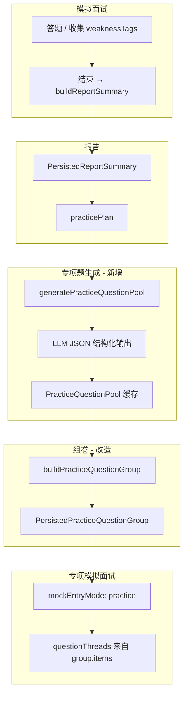

# 32. 弱项补练 — 报告驱动 LLM 题池（方案 B）

> **状态**：阶段 1 MVP + 阶段 2 体验已实现（2026-05-26）  
> **适用范围**：宇宙模拟面试页 `/showcase/mock-interview-space`（专项训练场景 + 报告承接）  
> **关联文档**：`docs/18.mock-interview-space后续开发边界规范.md`（若存在）、资料题管线（`MaterialQuestionPool` 模式）  
> **权威规范**：仓库根目录 `CODEX.md`

---

## 1. 背景与问题

### 1.1 产品目标

用户完成一轮**模拟面试**后，若存在明显弱项，应能进入**专项训练（弱项补练）**：

1. 自动带上**本场报告**识别出的弱项与推荐配置（题型、难度、题数等）；
2. 生成**与本场表现相关**的练习题，而不是从全局静态题库里硬匹配；
3. 预览题单后，以 `mockEntryMode: 'practice'` 进入模拟面试继续练。

### 1.2 当前实现（截至本文档编写时）

| 环节 | 现状 | 问题 |
|------|------|------|
| 报告 | 模拟面试结束生成 `PersistedReportSummary`，含 `weaknessTags`、`practicePlan` | 配置有了，题源没跟上 |
| 专项页 | `SpacePracticeScene` 从 `reportSummary.practicePlan` 自动填弱项/专区/题型 | 仅 UI 预填 |
| 组卷 | 优先 `PracticeQuestionPool`（`practice_report_pool`）；DEV 无题池时仍回退 `questionBank` | 生产需先「生成补练题」 |
| 继续补练 | 有 ready 题池则直接开练；否则进专项页并提示生成 | 与资料库「先预览再开练」对齐 |

**结论**：`practicePlan` 是「这一场」的，题目却是「全局演示题库」里凑的，产品语义断裂。

### 1.3 方案 B 核心结论

**不要扩展内置题库作为主路径**，改为：

```text
模拟面试结束 → 报告（已有）
    → 按 report 调用 LLM 生成 PracticeQuestionPool（按 sessionId 缓存）
    → 组卷（题数 / 顺序，复用 Material 组卷模式）
    → 预览 → 模拟面试（practice）
```

与**资料库**对称：

| 维度 | 资料库 | 弱项补练（方案 B） |
|------|--------|-------------------|
| 题池来源 | 用户导入 `.md`，规则拆题（可扩展 LLM） | **本场报告 + 作答/反馈**，LLM 生成 |
| 缓存键 | `documentId` | `sessionId`（或 `reportId`） |
| 组卷 | `buildMaterialQuestionGroup` | `buildPracticeQuestionGroupFromPool`（新/改） |
| 模拟面试入口 | `mockEntryMode: 'material'` | `mockEntryMode: 'practice'` |

---

## 2. 目标与非目标

### 2.1 目标（Must）

- [ ] 专项训练题**来源于本场报告上下文**，LLM 一次生成 N 道题写入题池。
- [ ] 题池按 `sessionId` 持久化（前端 `localStorage`，与资料题池同级）。
- [ ] 专项页：报告 `practicePlan` 自动预填；用户确认题数后 **「生成补练题」** → 预览 → **「开始模拟面试」**。
- [ ] 报告页「继续专项补练」：有题池则直接开练；无题池则进专项页并提示先生成题。
- [ ] 内置 `questionBank` 仅作 **无 LLM / 开发演示兜底**，不作为正式产品路径。

### 2.2 非目标（Won't，本期不做）

- 不替换资料库题管线。
- 不要求 LLM 在模拟面试过程中逐题实时出题（边练边生成）。
- 不合并资料题与弱项题到同一池（来源与缓存键不同，保持两源）。
- 不改造旧工作台 `src/views/workbench/*`（宇宙页边界见 Cursor 规则）。

---

## 3. 总体架构



### 3.1 单一事实来源

| 状态 | 归属 | 说明 |
|------|------|------|
| 报告与 `practicePlan` | `PersistedReportSummary` / 后端 `StoredInterviewReportSummary` | 模拟面试结束时写入 |
| 弱项题池 | `PracticeQuestionPool` | **生成补练题** 后写入，键为 `sessionId` |
| 本轮题单 | `PersistedPracticeQuestionGroup` | 组卷结果，开练前写入 `workbenchContext` |
| 草稿（题数/顺序） | 专项页本地 state | 未点「生成」前不影响题池 |

---

## 4. 数据模型

### 4.1 新增类型（建议文件）

**`src/types/practice-pool.ts`**

```ts
import type {
  PersistedPracticeDifficulty,
  PersistedPracticeFocusArea,
  PersistedPracticeQuestionType
} from '@/types/workbench'

export interface PracticeQuestionItem {
  id: string
  sessionId: string
  order: number
  title: string
  prompt: string
  difficulty: PersistedPracticeDifficulty
  questionType: PersistedPracticeQuestionType
  generatedBy: 'llm'
  focusAreas?: PersistedPracticeFocusArea[]
  referenceAnswer?: string
  /** 对应报告中的弱项标签或题审条目 */
  weaknessTag?: string
  sourceQuestionId?: string
}

export interface PracticeQuestionPool {
  sessionId: string
  reportId: string
  planSnapshot: PersistedPracticePlan  // 生成时冻结的 practicePlan
  questions: PracticeQuestionItem[]
  preparedAt: string
  status: 'idle' | 'preparing' | 'ready' | 'error'
  errorMessage?: string
}
```

### 4.2 扩展 `TrainingQuestionGroupSource`

**`src/types/workbench.ts`**

```ts
export type TrainingQuestionGroupSource =
  | 'practice_weakness'      // 旧：从 questionBank 匹配（兜底）
  | 'practice_report_pool'   // 新：从 PracticeQuestionPool 组卷
  | 'material_document'
```

`PersistedPracticeQuestionGroup` 增加可选字段（与资料对齐）：

- `sourceSessionId`：已有，继续用作 report/session 关联；
- `planSnapshot`：已有；
- 无需 `documentSnapshot`。

### 4.3 存储

**`src/utils/storage/practice-pool-storage.ts`**（对标 `material-pool-storage.ts`）

```ts
// WORKBENCH_STORAGE_KEYS 新增：
practiceQuestionPools: 'offerpilot.practice.questionPools'

// API：
getPracticeQuestionPool(sessionId: string): PracticeQuestionPool | null
setPracticeQuestionPool(pool: PracticeQuestionPool): PracticeQuestionPool
removePracticeQuestionPool(sessionId: string): void
```

缓存失效策略：

- 同一 `sessionId` 重新生成报告且 `practicePlan` 签名变化 → 删除旧 pool 或标记 `idle`；
- 用户切换报告/会话 → 专项页读取对应 `sessionId` 的 pool。

---

## 5. LLM 生成设计

### 5.1 调用方式

**推荐**：后端新增非流式接口（一次返回 JSON），复用 `RemoteLLMProvider` 所在栈的配置（`INTERVIEW_REMOTE_API_KEY`、`INTERVIEW_REMOTE_MODEL`）。

| 项 | 建议 |
|----|------|
| 路径 | `POST /api/interview/practice-pool/generate` |
| 请求体 | `{ sessionId, reportId?, questionCount, plan: PersistedPracticePlan }` |
| 响应体 | `{ pool: PracticeQuestionPool, created: boolean }` |

**备选（仅前端直连模型）**：开发期可用 Vite 代理 + 现有前端 env，但生产应与面试流统一走后端，避免 key 暴露。

### 5.2 输入上下文（Prompt 素材）

从已存储数据组装，**禁止猜字段**：

| 字段 | 来源 |
|------|------|
| `primaryWeakness` / `weaknessTags` | `PersistedReportSummary` |
| `practicePlan` | 同上（weaknessTag、zone、questionType、difficulty、focusArea、reason） |
| `questionReviews[]` | 报告 `questionReviews`：题目标题、用户回答、AI 反馈 |
| `answerSnapshot` | 可选摘要 |
| `sourceDocumentName` + 资料 excerpt | 若 `mockEntryMode === 'material'`，附资料章节片段（≤2k 字） |
| `topic` / `zone` | 本轮主题 |

### 5.3 输出 JSON Schema（模型必须遵守）

```json
{
  "questions": [
    {
      "title": "string，面试题标题",
      "prompt": "string，给候选人的完整题面",
      "difficulty": "easy | medium | hard",
      "questionType": "concept | code | scenario",
      "focusAreas": ["structure"],
      "referenceAnswer": "string，参考答案要点",
      "weaknessTag": "string，针对的弱项"
    }
  ]
}
```

约束（写入 system prompt）：

- 题目数量 = 请求的 `questionCount`（不足时在业务层标 `isShortfall`）；
- 每题必须显式针对 `practicePlan.weaknessTag` 或 `questionReviews` 中暴露的问题；
- 禁止与 `questionReviews` 中原题完全相同（应变形追问/递进）；
- 中文题面，适合前端直接展示。

### 5.4 服务层文件（建议）

| 层级 | 路径 |
|------|------|
| Prompt | `backend/src/utils/build-practice-pool-llm-messages.ts` |
| 解析校验 | `backend/src/utils/parse-practice-pool-llm-json.ts` |
| 服务 | `backend/src/services/practice-pool-service.ts` |
| 路由 | `backend/src/routes/interview-routes.ts`（挂载） |
| 前端 API | `src/services/practice/practice-pool-api.ts` |
| 前端生成 | `src/services/practice/practice-question-pool-builder.ts`（封装请求 + 落库） |

---

## 6. 组卷与模拟面试衔接

### 6.1 改造 `buildPracticeQuestionGroup`

**文件**：`src/services/practice/practice-question-group-builder.ts`

```ts
export function buildPracticeQuestionGroup(
  plan: PersistedPracticePlan,
  options: {
    reportSummary?: PersistedReportSummary | null
    pool?: PracticeQuestionPool | null  // 新增：优先使用
  }
): PracticeQuestionGroupBuildResult
```

逻辑：

1. 若 `options.pool?.status === 'ready'` 且 `questions.length > 0`：
   - 按 `plan.count` / `orderMode` / `shuffleSeed` 从 **pool.questions** 选取（可复用 `material-question-group-builder` 的洗牌工具函数，抽到 `practice-shuffle.ts` 避免重复）；
   - `group.source = 'practice_report_pool'`。
2. 否则：返回空组 + `isShortfall: true`（开发与生产一致，须先「生成补练题」）。

**不再**使用 `questionBank`（内置演示题库）作为专项补练路径。

### 6.2 `practicePlan` 生成规则（保持 + 小改）

报告内 `practicePlan` 仍在 `useMockInterviewSpaceMockState.buildReportSummary` / `report-service` 生成：

- `weaknessTag`：本场 `mockWeaknessSignals[0]`；
- `questionType`：由弱项文案正则推断（可改为：统计本轮题型占比，见阶段 2）；
- `questionCount`：建议默认与「补练生成数」解耦：报告给推荐值，用户在专项页可改。

### 6.3 开练入口统一

| 入口 | 行为（方案 B 后） |
|------|------------------|
| 专项页「开始模拟面试」 | 校验 pool `ready` → 组卷 → `handlePracticeStart` |
| 报告「继续专项补练」 | 有 pool → 直接组卷开练；无 pool → `openSceneContent('feedback')` 并 Toast 提示生成 |
| 总览「去专项训练」 | 进专项页；无报告则展示空态说明 |

---

## 7. 前端交互（宇宙页）

### 7.1 专项场景 `SpacePracticeScene`

对标资料库右侧卡片三步：

```text
第一步 · 查看当前弱项（来自 report，只读为主）
第二步 · 确认题数 / 题型 / 难度（草稿，改后不触发生成）
第三步 · 生成补练题（调用 LLM）→ 预览列表
第四步 · 开始模拟面试
```

交互细则（与资料库已落地规则对齐）：

- 修改题数/顺序模式：**不**实时刷新预览；
- 仅点击 **「生成补练题」** 后更新预览；
- 预览区展示「组卷设置已变更」占位（固定高度），避免卡片跳动。

### 7.2 新增 composable

**`src/composables/showcase/usePracticeQuestionPoolState.ts`**

对标 `useMaterialQuestionPoolState.ts`：

```ts
preparePracticeQuestions(sessionId, report, plan): Promise<{ ok, pool?, message? }>
resolvePoolForSession(sessionId): PracticeQuestionPool | null
getPoolStatusLabel(pool): string
```

### 7.3 页面编排

**`mock-interview-space.vue`**

- 注入 `selectedPracticePool`（按 `reportSceneSummary.sessionId`）；
- `handlePreparePracticeQuestions`：调 API → `setPracticeQuestionPool`；
- `practiceGroupPreview`：读 pool + `practiceCompileOptions`（题数、顺序）；
- 移除对 `questionBank` 预览的依赖。

### 7.4 总览引导（已完成文案方向）

总览「训练路径」说明：

- 按资料练 → 资料库；
- 按弱项补练 → 专项训练（需先完成模拟面试并生成报告）。

---

## 8. 后端 API 契约（草案）

### 8.1 `POST /api/interview/practice-pool/generate`

**Request**

```ts
interface GeneratePracticePoolRequest {
  sessionId: string
  reportId?: string
  questionCount: number
  plan: {
    weaknessTag: string
    focusArea?: string
    zone: string
    questionType: string
    difficulty: string
    reason?: string
  }
  /** 前端可选传入 questionReviews 摘要，减少后端再查存储 */
  questionReviews?: Array<{
    questionTitle: string
    userAnswer: string
    aiFeedback?: string
  }>
  sourceDocumentId?: string
}
```

**Response**

```ts
interface GeneratePracticePoolResponse {
  pool: PracticeQuestionPoolDto
  requestedCount: number
  actualCount: number
  isShortfall: boolean
}
```

**错误码**

| code | 含义 |
|------|------|
| `REPORT_NOT_FOUND` | 无报告，无法生成 |
| `LLM_UNAVAILABLE` | 未配置 remote key/model |
| `LLM_PARSE_FAILED` | 模型输出非合法 JSON |
| `SESSION_ID_REQUIRED` | 参数缺失 |

### 8.2 与报告 API 关系

- 报告仍用现有 `POST /api/interview/reports/generate`（Phase 28 契约）；
- 题池生成**独立接口**，避免报告接口超时；
- `practicePlan` 在报告中保留，作为生成题池的配置输入。

---

## 9. 实施分期

### 阶段 1 — 最小闭环（MVP）

1. 类型 + `practice-pool-storage` + 后端 generate API + JSON 解析。
2. `usePracticeQuestionPoolState` + 专项页「生成补练题」按钮。
3. `buildPracticeQuestionGroup` 优先读 pool。
4. 报告「继续补练」：无 pool 时跳转专项页。

**验收**：完成一轮模拟面试 → 专项 → 生成 5 题 → 预览 → 开练，题面与弱项/作答相关，不依赖 `questionBank`。

### 阶段 2 — 体验与一致性（已实现 2026-05-26）

1. `practicePlan.questionType` 改为统计本轮实际题型（`resolveDominantPracticeQuestionType` + 组卷项 / `questionBank`）。
2. 资料面试结束时报告写入 `sourceDocumentExcerpt`，生成补练题时传入 LLM（≤2k 字）。
3. `reportSignature` 与当前报告比对，不一致则题池置 `idle` 并提示重新生成。

### 阶段 3 — 可选增强

1. 题池落盘后端（多设备同步），不仅 `localStorage`。
2. 生成进度 SSE（长耗时模型）。
3. 用户编辑/删除单题后再开练。

---

## 10. 测试计划

| 类型 | 内容 |
|------|------|
| 单元测试 | `parse-practice-pool-llm-json` 合法/非法 JSON；组卷 `count` / `shuffleSeed` |
| 管线测试 | `__tests__/practice-question-pipeline.test.ts`（对标 `material-question-pipeline.test.ts`） |
| 手工 | 无报告进专项 → 空态；有报告未生成 → 不可开练；生成后开练 thread 与 preview 一致 |
| 兜底 | 关闭 LLM 环境变量 → 后端按复盘规则 mock 出题；无题池不可开练 |

---

## 11. 风险与对策

| 风险 | 影响 | 对策 |
|------|------|------|
| LLM 输出不稳定 | 生成失败或题数不足 | 严格 JSON schema + 重试 1 次；`isShortfall` 提示 |
| 延迟高 | 用户等待 | 按钮 loading；专项页先展示 plan，题池异步 |
| 与资料题混淆 | 改错场景 | 类型 `source` 区分；宇宙页边界规范禁止改 workbench |
| 报告无 `questionReviews` | 生成题泛化 | 回退 `answerSnapshot` + `weaknessTags`；材料模式附资料 excerpt |
| 成本 | API 费用 | 按 session 缓存 pool，同报告不重复生成 |

---

## 12. 文件清单（实现时对照）

### 新增

- `docs/32.弱项补练-报告驱动LLM题池（方案B）.md`（本文档）
- `src/types/practice-pool.ts`
- `src/utils/storage/practice-pool-storage.ts`
- `src/services/practice/practice-pool-api.ts`
- `src/services/practice/practice-question-pool-builder.ts`
- `src/composables/showcase/usePracticeQuestionPoolState.ts`
- `backend/src/utils/build-practice-pool-llm-messages.ts`
- `backend/src/utils/parse-practice-pool-llm-json.ts`
- `backend/src/services/practice-pool-service.ts`
- `__tests__/practice-question-pipeline.test.ts`

### 修改

- `src/types/workbench.ts` — `TrainingQuestionGroupSource`
- `src/utils/storage/workbench-storage.ts` — `WORKBENCH_STORAGE_KEYS`
- `src/services/practice/practice-question-group-builder.ts` — 优先 pool
- `src/components/showcase/mock-interview-space/scenes/SpacePracticeScene.vue` — 生成/预览 UX
- `src/views/showcase/mock-interview-space.vue` — 编排与 API
- `backend/src/routes/interview-routes.ts` — 新路由
- `backend/.env.example` — 若需单独模型名则文档说明（可复用 `INTERVIEW_REMOTE_MODEL`）

### 废弃 / 降级

- `src/views/workbench/mock-interview.data.ts` 的 `questionBank`：专项补练不再使用；仅旧 workbench 演示路径可能引用。

---

## 13. 与现有三条训练路径对照（给产品/开发对齐）

```text
资料库：  导入 md → 规则拆题 → MaterialQuestionPool → material 模拟面试

弱项补练：  模拟面试 → 报告 practicePlan → LLM → PracticeQuestionPool → practice 模拟面试

直接模拟：  演示用 questionBank（非方案 B 范围，逐步弱化）
```

---

## 14. 修订记录

| 版本 | 日期 | 说明 |
|------|------|------|
| v0.1 | 2026-05-25 | 初稿：方案 B 架构、模型、API、分期与文件清单 |
| v0.2 | 2026-05-25 | 阶段 1 落地；产品决策：无多设备同步、无 questionBank 兜底、须先生成题池、报告含未作答题参考答案、推荐题数与组卷题数解耦 |
| v0.3 | 2026-05-26 | 阶段 2：题型众数、`sourceDocumentExcerpt`、`reportSignature` 题池失效 |
