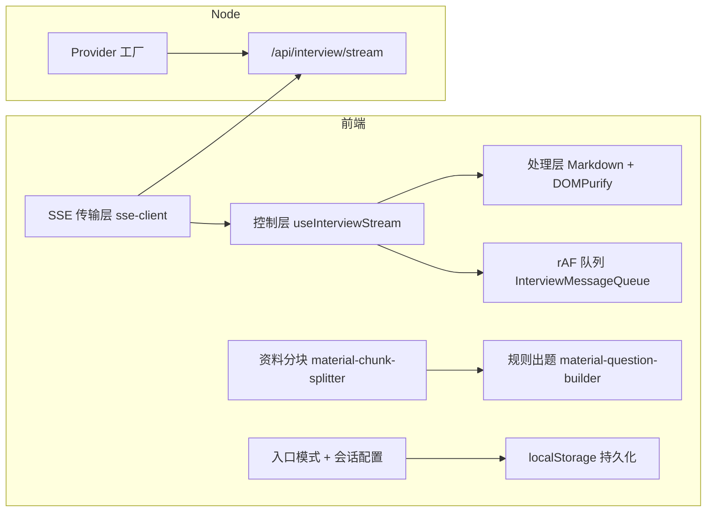
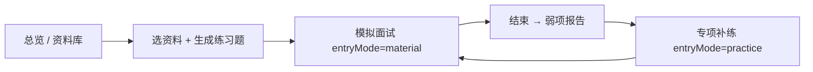

# 前端实习面试问答：五大核心实现

> 面向简历/项目介绍中的五点核心实现，结合本仓库真实代码整理。  
> 适用岗位：前端开发实习、初级前端。  
> 建议用法：先通读「术语速查」，再按章节背诵「标准答法」，场景题用自己的话复述一遍。

---

## 一、术语速查（面试前先背熟）

> **怎么读这张表**：从左到右 —— 名词 → 英文原名 → 在项目里干什么 → **大白话**（零基础也能懂）。  
> 面试时：大白话用来「自己听懂」；第二、三列用来「说得专业一点」。


| 术语               | 英文/代码                    | 在本项目里指什么                                                                                                                  | 大白话                                                                                               |
| ---------------- | ------------------------ | ------------------------------------------------------------------------------------------------------------------------- | ------------------------------------------------------------------------------------------------- |
| **SSE**          | Server-Sent Events       | 基于 HTTP 的单向推送：服务端持续写 `text/event-stream`，浏览器边收边渲染 AI 回复。                                                                  | 像**听广播**：服务器一直往外播，浏览器一直往里收，字一个个蹦出来；**不用**你和服务器来回发很多条消息（和打电话式的 WebSocket 不同）。                      |
| **契约**           | Contract                 | 前后端（及 C++）共同遵守的**固定协议**：请求体字段、SSE 事件名（`chunk`/`done`/`error`）、`data` JSON 形状。改契约要三方评审，避免联调时「各写各的」。                        | 像**签合同**：约好「我发什么字段、你回哪几种事件、名字叫 chunk 还是 done」。大家都按合同写，联调才不会一方改名叫 `text`、另一方还在找 `content`。         |
| **冻结契约**         | Freeze the contract      | **不是** `Object.freeze()` 语法本身，而是**工程纪律**：对外 API 与事件类型写在 `backend/src/types/interview.ts` 等权威文件里，禁止前端/Node/C++ 私自改字段或增删事件。 | 不是 JS 里那个「冻住对象」的语法，而是**不许乱改合同**：要改接口得开会、改类型文件，不能某个人悄悄加一个新事件名。                                     |
| **收敛**           | Convergence              | 宇宙页内多条路径（资料模拟、报告后专项）产生的零散状态，归并到**单一事实来源**（`PersistedWorkbenchContext` + `sessionConfigKey`）。                              | 你从**资料**或**专项**不同门进模拟，以前像好几个本子记笔记；现在**只认一本总账本**（`localStorage`），宇宙页各场景都读这一本。                      |
| **串台**           | Crosstalk                | A 入口的配置/会话数据泄漏到 B 入口，例如从「资料出题」进模拟，却还带着上次「专项训练」的题型难度。                                                                      | 像收音机**串台**：本该播资料题的台，却混进上次专项的「中等难度、代码题」。                                                           |
| **entryMode**    | `PersistedMockEntryMode` | 标记本轮模拟**从哪条业务路径开始**：`material`（资料题组）/ `practice`（弱项专项）/ `direct`（历史默认，非主路径）。                                              | **产品上主要只用前两个**；`direct` 多是代码默认值或报告页「继续模拟」的退路，不是总览上的第三条大路。                                         |
| **workbench 命名** | workbench types/storage  | 类型在 `types/workbench.ts`、持久化在 `workbench-storage.ts`，宇宙页通过 `useWorkbenchPersistence` 读写。                                  | **不是**让你去改 `views/workbench` 旧页面；是早期产品名遗留的**共用数据层**文件名。                                           |
| **BFF**          | Backend for Frontend     | Node 网关层：前端只打 `/api/`*，由 Node 选 mock / 真实 LLM / 未来 C++，前端不直连引擎。                                                           | 前端**只找自己家门口的传达室**（`/api`），由传达室决定今天用「假回复演示」还是「真大模型」还是以后的 C++；前端**不**拿钥匙直接去厂商或 C++ 机房。              |
| **Provider 工厂**  | Provider Factory         | `createInterviewProvider()` 按环境变量返回不同实现，对外 `streamInterview` 接口一致。                                                        | 像**换电池**：外壳接口一样，里面可装「演示电池」「真 AI 电池」「以后 C++ 电池」，配置一下用哪块，**不用**把整台机器拆开重做。                           |
| **rAF**          | `requestAnimationFrame`  | 与浏览器刷新率对齐的调度 API，本项目中用于**每帧合并**高频 token 再更新 DOM。                                                                          | 屏幕大约每秒刷 60 次；AI 一秒可能推几十个字，如果每个字都改一次页面会**卡、闪**。rAF 的意思是：**等下一帧再一起画**，这一帧里收到的字先攒一攒，画面更顺。            |
| **XSS**          | Cross-Site Scripting     | 恶意脚本注入页面；流式 Markdown 若直接 `v-html` 未消毒，风险极高。                                                                               | 坏人把**可执行的网页脚本**混进 AI 回复或资料里，你一渲染就可能在浏览器里偷数据。所以要先「洗干净」再显示。                                         |
| **DOMPurify**    | —                        | 对 HTML 字符串做白名单过滤的库，`MarkdownMessage.vue` 渲染前使用。                                                                           | **洗碗剂**：把 Markdown 转出来的 HTML 里危险标签（如 `<script>`）删掉，只留安全的标题、段落、代码块再显示。                             |
| **分块**           | Chunk                    | ① SSE 的一小段文本事件；② 资料 Markdown 按标题切出的结构化段落（`MaterialChunk`）。                                                                | 两个意思：**流式**时是一小段一小段回复；**资料**时是把长文章按「第一章、第二节」切成好几段，每段不超过约 1000 字，方便出题和发给模型。                        |
| **LLM**          | Large Language Model     | 本仓库通过 Node `RemoteLLMProvider` 调用的外部大模型（如百炼、DeepSeek 等），需配置 `INTERVIEW_REMOTE_API_KEY`。                                   | **会写文章、会对话的云端大脑**；要联网、要 API Key、按量计费。不配 Key 可以用 mock **假大脑**把流程跑通。                                |
| **mock**         | Mock                     | `INTERVIEW_PROVIDER=mock` 或前端无 `/api` 时的本地模拟流，不调用真模型。                                                                     | **排练用的假回复**：界面、流式效果都和真的一样，但字是程序写好的或随机切的，**不花钱、不需要 Key**，适合演示和前端开发。                                |
| **token**        | Token                    | 大模型流式输出时的最小文本片段；本项目用 rAF 队列合并后再更新界面。                                                                                      | 可以理解成**蹦出来的一个字或一小串字**；来得太密页面会卡，所以要先攒一攒再显示。                                                        |
| **DOM**          | Document Object Model    | 浏览器里的页面结构树；改 `displayContent` 会触发 Vue 更新 DOM。                                                                             | 浏览器里**看得见的那张网页**的「骨架+文字」；更新太频繁就像一直在重画整张海报，会累、会闪。                                                  |
| **API Key**      | API Key                  | 调用商用大模型时的密钥；面试真 AI 配在 `backend/.env` 的 `INTERVIEW_REMOTE_API_KEY`。                                                        | **进大模型服务器的门禁卡**；不能写进 Git 给别人用，只能自己本地或服务器配置。没有卡也能玩 mock。                                           |
| **Vite 代理**      | `server.proxy`           | 开发时把 `/api`、`/deepseek` 等路径转发到本机 Node 或厂商域名，解决浏览器跨域。                                                                      | 本地开发时**中转站**：浏览器以为在访问自己网站，其实 Vite 帮你转发到真正的后端或 DeepSeek，避免浏览器报「跨域不允许」。**只在开发环境方便用**，上线要另配 Nginx 等。 |
| **持久化**          | Persistence              | 把 `workbenchContext`、会话等写入 `localStorage`，刷新页面可恢复。                                                                        | **记在浏览器本地的小本本**，关页面再打开还能接着上次的状态（不是记在服务器数据库里，除非以后接后端存储）。                                           |


---

## 二、总览：五条线如何串起来




**一句话项目价值**：在宇宙模拟面试页内，走通「**资料 → 模拟 → 弱项报告 → 专项补练**」闭环，同时保证 AI 反馈**流式、安全、不卡**，刷新后**可恢复**正确会话上下文。

**产品主路径（当前宇宙页）**：




> 说明：代码里仍有 `entryMode=direct`（直开）类型，但**不是**宇宙页上的主按钮入口，见第六节「产品入口 vs 代码三分法」。

---

## 三、核心实现 ①：SSE 流式架构 + 安全 Markdown

### 3.1 我做了什么（可背）

采用**传输 → 控制 → 处理**三层解耦：

1. **传输层**：`frontend/src/services/sse/sse-client.ts` 的 `consumeSSEStream` 用缓冲区按 `\n\n` 切 **SSE 帧**，解析 `event:` / `data:`。
2. **控制层**：`useInterviewStream.ts` 订阅 `start` / `chunk` / `done` / `error`，维护消息列表、中止、重试。
3. **处理层**：`MarkdownMessage.vue`：`renderMarkdownText` → `DOMPurify.sanitize` → `v-html`。
4. **双模式**：`interview-stream.ts` 有 `VITE_INTERVIEW_SSE_URL` 或开发环境 `/api/interview/stream` 走 **remote**；否则本地 `ReadableStream` 模拟 **mock**，便于无后端联调。

#### 相关代码（仓库摘录 · 带逐行注释）

> 下面每段都是**教学摘录**（略去无关分支），`//` 注释说明变量、函数在干什么。

**传输层** — `frontend/src/services/sse/sse-client.ts`：缓冲 + `\n\n` 切帧 + 解析 `event` / `data`

```ts
// frontend/src/services/sse/sse-client.ts

/** 从累积字符串里切出「完整 SSE 帧」，半截留给下次 read */
const splitSSEFrames = (buffer: string) => {
  const normalizedBuffer = buffer.replace(/\r/g, '') // 统一换行，避免 Windows \r\n 干扰
  const delimiter = '\n\n' // SSE 标准：一帧结束用空行分隔
  const frames: string[] = [] // 本轮已能解析的完整帧文本
  let remaining = normalizedBuffer // 还不够一帧的尾巴

  while (remaining.includes(delimiter)) {
    const delimiterIndex = remaining.indexOf(delimiter)
    frames.push(remaining.slice(0, delimiterIndex)) // 切下完整一帧
    remaining = remaining.slice(delimiterIndex + delimiter.length)
  }
  return { frames, remaining } // remaining 下次和网络新数据拼接
}

/** 把一帧文本（多行 event/data）变成 { event, data } 对象 */
const parseSSEFrame = (frameText: string): SSEFrame | null => {
  const lines = frameText.split('\n').map(item => item.trim()).filter(Boolean)
  if (!lines.length) return null

  let event = 'message' // 默认事件名；面试流一般是 chunk / done / error
  const dataLines: string[] = [] // 多行 data: 要拼成一条

  lines.forEach((line) => {
    if (line.startsWith(':')) return // 注释行，忽略
    if (line.startsWith('event:')) {
      event = line.replace(/^event:\s*/, '').trim() || 'message'
      return
    }
    if (line.startsWith('data:')) {
      dataLines.push(line.replace(/^data:\s*/, '')) // 去掉 "data: " 前缀
    }
  })
  return { event, data: dataLines.join('\n') }
}

/** 消费 SSE 流的主入口：只负责「读字节 → 切帧 → 回调」，不管业务 */
export const consumeSSEStream = async ({
  signal,        // AbortSignal：用户点停止时中止 read
  createReader,  // 工厂函数：返回 fetch body 的 reader
  onEvent,       // 每解析出一帧就调用，上层根据 event 分支
  onDone,
  onError
}) => {
  let reader: ReadableStreamDefaultReader<string> | null = null
  let buffer = '' // 网络半包粘包都先堆这里

  try {
    reader = await createReader(signal)
    while (true) {
      if (signal?.aborted) throw new DOMException('Stream aborted', 'AbortError')

      const { value, done } = await reader.read() // value 可能只是半帧
      if (done) break

      buffer += value // 拼到缓冲区
      const { frames, remaining } = splitSSEFrames(buffer)
      buffer = remaining

      frames.forEach((frameText) => {
        const frame = parseSSEFrame(frameText)
        if (frame) onEvent(frame) // 例如 { event:'chunk', data:'{"content":"好"}' }
      })
    }
    // 流结束若 buffer 里还有最后一帧
    if (buffer.trim()) {
      const trailingFrame = parseSSEFrame(buffer)
      if (trailingFrame) onEvent(trailingFrame)
    }
    onDone?.()
  } catch (error) { /* 非用户中止则 onError */ }
}
```

**控制层** — `frontend/src/composables/interview/useInterviewStream.ts`：统一处理 `start` / `chunk` / `done` / `error`

```ts
// frontend/src/composables/interview/useInterviewStream.ts

const messageQueue = new InterviewMessageQueue() // rAF 合并高频 chunk，见实现②
let activeMessageId = ''   // 当前正在流式输出的 assistant 消息 id
let activeAbort: (() => void) | null = null // 调用后可中止 fetch/SSE
const streamMode = ref<'idle' | 'mock' | 'remote'>('idle') // 真 AI 还是本地假流

/** 用户提交答案后启动一轮面试官反馈流 */
const startStream = (params: StartInterviewStreamParams) => {
  stopStream() // 若上一轮没结束，先清理

  const streamTask = startInterviewStream(params, {
    onEvent: event => {
      // --- start：流刚开始，创建空消息并注册「合并后更新 UI」的回调 ---
      if (event.type === 'start') {
        isStreaming.value = true
        activeMessageId = event.messageId
        streamMode.value = event.mode || 'mock' // remote=走 /api；mock=本地假流

        const assistantMessage = createMessage('assistant', '', threadId, 'markdown', 'streaming')
        assistantMessage.id = event.messageId
        appendMessage(assistantMessage)

        // handler：rAF 一帧合并后的整段 delta，在这里才真正改 Vue 状态
        messageQueue.register(event.messageId, (delta) => {
          patchMessage(event.messageId, item => ({
            ...item,
            content: `${ item.content }${ delta }`,         // 完整原文（持久/重试用）
            displayContent: `${ item.displayContent }${ delta }` // 界面展示用
          }))
        })
        return
      }

      // --- chunk：又来一小段字，先 enqueue，不立刻 patchMessage ---
      if (event.type === 'chunk') {
        const parsed = parseInterviewStreamChunk(event.messageId, event.chunk || '')
        if (parsed?.type === 'chunk' && parsed.chunk) {
          messageQueue.enqueue(parsed.messageId, parsed.chunk)
        }
        return
      }

      // --- done：必须先 flush 队列，否则会丢最后几个字 ---
      if (event.type === 'done') {
        messageQueue.flushNow(event.messageId)
        messageQueue.unregister(event.messageId)
        patchMessage(event.messageId, item => ({ ...item, status: 'done' }))
        finalizeStreamState() // 清 activeMessageId、isStreaming
        return
      }

      // --- error：同样先 flush，再显示错误，并记下可重试参数 ---
      if (event.type === 'error') {
        messageQueue.flushNow(event.messageId)
        messageQueue.unregister(event.messageId)
        // patchMessage status:'error' + retryableState = { params, reason:'error' }
        finalizeStreamState()
      }
    }
  })

  activeAbort = streamTask.abort // 供 stopStream 调用
}

/** 用户点「停止生成」 */
const stopStream = () => {
  if (activeMessageId) {
    messageQueue.flushNow(activeMessageId)  // 把缓冲区里剩余字刷到界面
    messageQueue.unregister(activeMessageId)
    patchMessage(activeMessageId, item => ({
      ...item,
      status: item.content ? 'aborted' : 'done' // 有内容标中止，否则算正常结束
    }))
    // 保留 retryableState，方便「重新生成」
  }
  activeAbort?.() // 中断网络请求
  finalizeStreamState()
}
```

**处理层** — `frontend/src/components/message/MarkdownMessage.vue`：Markdown → 消毒 → 渲染

```vue
<!-- frontend/src/components/message/MarkdownMessage.vue -->
<script lang="ts" setup>
import DOMPurify from 'dompurify'
import { renderMarkdownText } from '@/components/MarkdownPreview/plugins/markdown'

const props = defineProps<{ content: string }>() // 流式追加后的 Markdown 纯文本

/** 计算属性：content 变就重新渲染；每次走 转 HTML → 消毒 */
const safeHtml = computed(() => {
  const html = renderMarkdownText(props.content || '') // 如 **加粗** → <strong>
  return DOMPurify.sanitize(html) // 去掉 <script> 等危险标签
})
</script>

<template>
  <!-- v-html 只绑已经消毒的 safeHtml，禁止直接绑原始 AI 文本 -->
  <div class="markdown-message" v-html="safeHtml" />
</template>
```

**双模式** — `frontend/src/services/sse/interview-stream.ts`：有接口地址走 remote，否则 mock

```ts
// frontend/src/services/sse/interview-stream.ts

/** 决定请求打哪个 URL；空字符串表示不走网络，用本地 mock */
const resolveInterviewStreamEndpoint = () => {
  const configuredEndpoint = import.meta.env.VITE_INTERVIEW_SSE_URL?.trim() || ''
  if (configuredEndpoint) return configuredEndpoint // .env 显式配置了完整地址

  // 开发环境默认 /api/interview/stream，由 Vite 代理到 localhost:3030
  return import.meta.env.DEV ? '/api/interview/stream' : ''
}

/** 有 endpoint → remote（真 SSE）；无 → mock（本地 ReadableStream 切片） */
const resolveInterviewStreamMode = (): InterviewStreamMode => (
  resolveInterviewStreamEndpoint() ? 'remote' : 'mock'
)

/** mock 专用：把一整段假回复切成多段，每隔 delay ms 吐 chunkSize 个字符 */
const splitTextToReader = (text: string, delay = 18, chunkSize = 14) => {
  let offset = 0 // 当前切到哪了
  const stream = new ReadableStream<string>({
    async pull(controller) {
      if (offset >= text.length) {
        controller.close() // 字吐完了
        return
      }
      await new Promise(resolve => setTimeout(resolve, delay)) // 模拟网络间隔
      const nextOffset = Math.min(offset + chunkSize, text.length)
      controller.enqueue(text.slice(offset, nextOffset)) // Enqueue 一小段
      offset = nextOffset
    }
  })
  return stream.getReader()
}
```

**冻结契约（类型权威）** — `backend/src/types/interview.ts`

```ts
// backend/src/types/interview.ts — Node / C++ / 前端都要对齐这三种事件

/** 流式增量：content 是要拼到气泡里的字 */
export interface InterviewStreamChunkEvent {
  type: 'chunk'
  content: string
}

/** 本轮结束：前端要 flush 队列并 status=done */
export interface InterviewStreamDoneEvent { type: 'done' }

/** 失败：带 code 方便日志，message 给用户看 */
export interface InterviewStreamErrorEvent {
  type: 'error'
  code: string
  message: string
}

/** Provider 内部 yield 的联合类型；写成 SSE 时 event 名与 type 对应 */
export type InterviewProviderEvent =
  | InterviewStreamChunkEvent
  | InterviewStreamDoneEvent
  | InterviewStreamErrorEvent
```

**开发代理** — `frontend/vite.config.ts`（`/api` → 本机 Node）

```ts
// frontend/vite.config.ts
const interviewBackendOrigin =
  env.VITE_INTERVIEW_BACKEND_ORIGIN || 'http://localhost:3030' // backend 地址

server: {
  port: 2048, // 前端 dev 端口
  proxy: {
    '/api': {
      target: interviewBackendOrigin, // 浏览器请求 /api/xxx → 转到 Node 3030
      changeOrigin: true // 改 Host 头，避免部分后端校验失败
    }
  }
}
```

### 3.2 实现效果

- 用户提交回答后，面试官反馈**逐字/逐段出现**，而不是等整段生成完才显示。
- `streamModeLabel` 可区分「真实 AI 流式」与「本地模拟流」，方便演示与排错。
- Markdown 中的代码块、列表能渲染，同时**过滤** `<script>` 等危险标签，降低 XSS 面。

### 3.3 基础题与标准答

**Q1：SSE 和 WebSocket 有什么区别？为什么 AI 对话常用 SSE？**

**答：**

- **SSE**：基于 HTTP，默认**服务端 → 客户端**单向；浏览器可用 `fetch` + `ReadableStream` 或 `EventSource`；穿透代理、复用 Cookie/鉴权较简单。
- **WebSocket**：全双工，适合游戏、协作编辑等需要客户端高频上报的场景。
- **AI 回复**本质是服务端持续输出文本，客户端主要是展示与中止，SSE 足够且实现成本更低。本项目面试流就是「用户答 → 服务端评 → 流式吐 Markdown」。

**Q2：SSE 文本长什么样？`chunk` / `done` / `error` 各表示什么？**

**答：**

```http
event: chunk
data: {"content":"你好"}

event: done
data: {}

event: error
data: {"code":"...","message":"..."}
```

- `chunk`：增量内容，前端 append 到当前 assistant 消息。
- `done`：本轮流结束，要把缓冲区 flush 完并把消息状态标为 `done`。
- `error`：流中失败，展示错误文案并允许重试。

契约类型见 `backend/src/types/interview.ts` 的 `InterviewProviderEvent`。

**Q3：为什么不用 WebSocket / 长轮询？**

**答：**


| 方案            | 不选或次要的原因                                     |
| ------------- | -------------------------------------------- |
| WebSocket     | 需要额外握手与网关配置；面试场景无高频双向信令；团队希望统一走 `/api` HTTP。 |
| 长轮询           | 延迟与连接开销差；实现「伪流式」体验差。                         |
| 普通 POST 一次性返回 | 首字延迟高，长反馈等待久，不符合 AI 产品预期。                    |


**Q4：什么是「冻结契约」？和 TypeScript 接口有什么关系？**

**答：**

- **契约** = 联调合同：例如 `POST /api/interview/stream` 的请求字段、`event: chunk` 的 JSON 里是否有 `content` 等。
- **冻结** = 变更流程锁死：先改 `backend/src/types`，再 Node Provider，再前端 `sse-types`，C++ 对齐；**禁止**前端私自加 `chunk2` 或改 `done` 语义。
- 好处：前端、Node、C++ 可并行开发，换 `mock` / `remote` / `cpp` 时页面逻辑不变。

**Q5：`DOMPurify` 为什么必要？只信 Markdown 解析器不够吗？**

**答：**

不够。Markdown 会生成 HTML（如 `<a href="javascript:...">`）。流式场景下攻击面更大，因为内容动态增长。  
本项目在 `MarkdownMessage.vue` 里 **先渲染再消毒**，最后才 `v-html`。这是「处理层」安全边界，与 SSE 解析无关，职责清晰。

**Q6：`EventSource` 和 `fetch` 流你们用的哪种？**

**答：**

面试主路径用 `**fetch` + `ReadableStream` + 自研 `consumeSSEStream`**，原因包括：需要 `POST` 带面试上下文（题目、资料摘要、`AbortSignal` 中止），`EventSource` 仅 GET 不便。聊天演示页 `MarkdownPreview` 仍保留 ReadableStream 打字机效果，是另一路 UI 体验。

### 3.4 场景题

**场景 1：面试官问「TCP 把一条 SSE 拆成两半，前端会怎样？」**

**答：**

不能假设一次 `read()` 就是一帧。`sse-client.ts` 维护 `buffer`，只有发现 `\n\n` 才 `parseSSEFrame`。尾部不足一帧的留在 `remaining`，下次再拼。这是传输层核心职责，避免 JSON 解析半截报错。

**场景 2：流式过程中用户点「停止生成」？**

**答：**

`useInterviewStream` 的 `stopStream`：`AbortController` 中止请求 → `messageQueue.flushNow` 刷完已缓冲文字 → `unregister` → 消息标 `aborted`，并保留 `retryableState` 供「重新生成」。

### 3.5 困难点与解决（STAR 简版）


| 困难                    | 解决                                                                                    |
| --------------------- | ------------------------------------------------------------------------------------- |
| 半包/粘包导致偶发解析失败         | 帧缓冲 + `\n\n` 分隔，与 `docs/前端SSE学习路线图.md` 中教学法一致。                                        |
| mock 与 remote 返回格式不一致 | 控制层统一成 `InterviewStreamHandlers` 事件；remote 走 SSE，mock 走 `splitTextToReader` 模拟 chunk。 |
| 流式 Markdown 安全        | 强制走 `MarkdownMessage.vue` 消毒，禁止业务组件直接拼 HTML。                                          |


---

## 四、核心实现 ②：rAF 消息渲染队列

### 4.1 我做了什么

`InterviewMessageQueue`（`frontend/src/services/message/interview-message-queue.ts`）：

- 每个 `messageId` 一个字符串数组缓冲区；
- `enqueue` 只 push，不立刻改 DOM；
- `scheduleFlush` 里 `requestAnimationFrame`，**每帧** `join` 后一次性交给 handler；
- `done` / `stop` 时 `flushNow`，避免丢最后几帧。

`useInterviewStream` 在 `chunk` 事件里 `enqueue`，handler 里 `patchMessage` 更新 `content` / `displayContent`。

#### 相关代码（仓库摘录 · 带逐行注释）

**rAF 队列本体** — `frontend/src/services/message/interview-message-queue.ts`

```ts
// frontend/src/services/message/interview-message-queue.ts

/** 合并后的回调：参数 delta 是本帧内所有 chunk 拼成的一段字符串 */
type FlushHandler = (delta: string) => void

export class InterviewMessageQueue {
  /** key=消息 id，value=待刷新的 chunk 字符串数组（先来先 push） */
  private buffers = new Map<string, string[]>()
  /** key=消息 id，value=该消息 flush 时要调用的 UI 更新函数 */
  private handlers = new Map<string, FlushHandler>()
  /** 当前是否已预约下一帧 rAF；非 null 表示「已排队，别重复 requestAnimationFrame」 */
  private frameId: number | null = null

  /** 流 start 时注册：这条消息以后合并完字就调 handler */
  register(messageId: string, handler: FlushHandler) {
    this.handlers.set(messageId, handler)
  }

  /** 流结束/停止时注销，并清 buffer */
  unregister(messageId: string) {
    this.handlers.delete(messageId)
    this.buffers.delete(messageId)
    if (!this.buffers.size && this.frameId !== null) {
      cancelAnimationFrame(this.frameId)
      this.frameId = null
    }
  }

  /** 收到一小段 chunk：只进 buffer，不碰 Vue */
  enqueue(messageId: string, delta: string) {
    if (!delta) return
    const nextBuffer = this.buffers.get(messageId) || []
    nextBuffer.push(delta) // 例如 ['你','好','呀'] 三个 token
    this.buffers.set(messageId, nextBuffer)
    this.scheduleFlush()
  }

  /** 预约「下一帧屏幕刷新时」再统一 flush */
  private scheduleFlush() {
    if (this.frameId !== null) return // 本帧已预约过，同一帧内多次 enqueue 共用一个 rAF

    this.frameId = requestAnimationFrame(() => {
      this.frameId = null
      this.flushNow() // 刷所有 messageId 的 buffer
      if (this.buffers.size) this.scheduleFlush() // 若 flush 期间又 enqueue，再约一帧
    })
  }

  /** 把某条消息 buffer 拼成一句，交给 register 时的 handler */
  private flushMessage(messageId: string) {
    const buffer = this.buffers.get(messageId)
    const handler = this.handlers.get(messageId)
    if (!buffer?.length || !handler) return

    this.buffers.delete(messageId)
    handler(buffer.join('')) // '你'+'好'+'呀' → '你好呀'，只触发一次 patchMessage
  }

  /** done/stop 必须立刻刷，不能等下一帧 */
  flushNow(messageId?: string) {
    if (messageId) {
      this.flushMessage(messageId)
      return
    }
    Array.from(this.buffers.keys()).forEach(id => this.flushMessage(id))
  }
}
```

**控制层接入** — `useInterviewStream.ts` 里 register + enqueue

```ts
// frontend/src/composables/interview/useInterviewStream.ts

// start 事件：告诉队列「这条 messageId 合并完后怎么更新 Vue」
messageQueue.register(event.messageId, (delta) => {
  patchMessage(event.messageId, item => ({
    ...item,
    content: `${ item.content }${ delta }`,
    displayContent: `${ item.displayContent }${ delta }`
  }))
})

// chunk 事件：只 enqueue，patchMessage 发生在 rAF 回调里
if (event.type === 'chunk') {
  messageQueue.enqueue(parsed.messageId, parsed.chunk)
}

// done：必须先 flushNow，否则 buffer 里最后几个字永远不会上屏
if (event.type === 'done') {
  messageQueue.flushNow(event.messageId)
  messageQueue.unregister(event.messageId)
}
```

**列表滚动** — `frontend/src/components/message/MessageList.vue`（内容变长时滚到底）

```ts
// frontend/src/components/message/MessageList.vue

const listRef = ref<HTMLElement | null>(null) // 消息列表 DOM
/** scrollVersion 变化（消息变长）时，下一帧再滚，避免和 rAF 更新抢同一帧布局 */
const scrollToBottom = () => {
  requestAnimationFrame(() => {
    const el = listRef.value
    if (!el) return
    el.scrollTop = el.scrollHeight // 滚到最底，让用户看到最新字
  })
}
```

### 4.2 实现效果

- 模型 1 秒推几十个小 chunk 时，DOM 更新从「几十次/秒」降到「最多约 60 次/秒（跟显示器刷新）」。
- 滚动、选中、输入框焦点更稳定，**主观卡顿感**明显减轻。
- 与 `MessageList.vue` 的 `scrollVersion` 配合，列表仍在内容变长时平滑滚到底。

### 4.3 基础题与标准答

**Q1：为什么会出现 UI 抖动（jank）？**

**答：**

每个 token 触发 Vue 响应式更新 → 虚拟 DOM diff → 布局/绘制。频率超过屏幕刷新能力时，主线程被占满，帧率掉下去，用户看到闪烁、滚动抽搐。

**Q2：为什么用 rAF 而不是 `setTimeout(0)` 或 `debounce`？**

**答：**


| 手段               | 说明                                             |
| ---------------- | ---------------------------------------------- |
| `setTimeout`     | 与屏幕刷新不同步，可能一帧内多次或跨帧堆积，仍可能抖。                    |
| `debounce(50ms)` | 人为增加 50ms 延迟，流式「跟手性」变差。                        |
| **rAF**          | 与浏览器绘制周期对齐，**合并同一帧内所有 delta**，延迟通常 ≤16ms，观感更顺。 |


**Q3：如果不用队列，直接 `content += chunk` 可以吗？**

**答：**

功能上可以，但在 remote 高频 chunk 下实测更容易卡。队列是**性能优化层**，不改变业务语义；`done` 时必须 flush，保证最终文本完整。

### 4.4 场景题

**场景：最后一帧 chunk 和 `done` 几乎同时到达，会丢字吗？**

**答：**

`done` 分支先 `flushNow(messageId)` 再 `unregister`，确保缓冲区清空后才把状态标 `done`。`stopStream` 同样先 flush 再中止。

### 4.5 困难点与解决


| 困难              | 解决                                     |
| --------------- | -------------------------------------- |
| 停止生成后界面少一截      | `stopStream` 显式 `flushNow`，不依赖下一帧 rAF。 |
| 多消息并行（多 thread） | `Map<messageId, buffer[]>` 隔离，互不污染。    |


---

## 五、核心实现 ③：面试资料分块与驱动出题

> **一句话（简历/自我介绍）**：支持 **Markdown** 与 **Word（.docx）** 导入；按标题层级切分资料并控制块长；基于分块规则生成练习题池；支持按**章节**、**随机**与**难度**组卷；在浏览器内完成 Word 解析与结构化出题，**无需额外后端**处理导入与题池链路。

### 5.1 我做了什么

1. **导入（浏览器内）**
  - **Markdown（`.md`）**：读入 `rawText` 后直接进入分块与出题链路。  
  - **Word / Docs（`.docx`）**：`parse-docx-file.ts` 用 **mammoth** 在浏览器把 `.docx` 转成 Markdown（映射 Word「标题 1～4」→ `#`～`####`），再 `prepareMaterialRawText` 归一化面经体（如「答：」分隔），与 `.md` **共用同一套**分块与出题代码。  
  - 旧版 `.doc` 提示另存为 `.docx`；资料正文落 `PersistedLibraryDocument`，不为此单独加后端解析接口。
2. **分块**：`material-chunk-splitter.ts`
  - 按 `#` ~ `####` 标题层级切段；  
  - 单块 ≤ **1000** 字符，过长按窗口切分（带 100 字符重叠策略防断句）；  
  - 输出 `MaterialChunk`：`heading`、`level`、`text`、`charStart`/`charEnd`。
3. **出题（规则引擎）**：`material-question-builder.ts`  
  - 对每个 `MaterialChunk` 生成 0～N 道 `MaterialQuestionItem`（章节讲解、代码围栏题、面试题样式标题等），汇总为 `MaterialQuestionPool`（`generatedBy: 'rule'`）。  
  - 不调 LLM 即可在资料库「生成练习题」。
4. **组卷**：`material-question-group-builder.ts` + 宇宙页资料库 UI  
  - `orderMode`：**按章节**（`chapter`，按块顺序）、**随机**（`random` + `shuffleSeed` 可复现洗牌）、**难度阶梯**（`difficulty_ladder`）、**单一难度**（`single_difficulty`）；  
  - 可叠加 `difficultyFilter`、`topicFilter` 与题数 `count`，输出 `PersistedPracticeQuestionGroup`。  
5. **模拟闭环**：组卷项带 `sourceChunkId`、`sourceDocumentId`；`interview-stream.ts` 把 `sourceDocumentExcerpt` 等拼进 prompt，报告可回溯资料片段。

#### 相关代码（仓库摘录 · 带逐行注释）

**Word 浏览器解析 → Markdown** — `frontend/src/services/material/parse-docx-file.ts`

```ts
// frontend/src/services/material/parse-docx-file.ts

/** Word 内置 / 中文「标题 1～4」→ h1～h4，供后续按 # 切节 */
const DOCX_HEADING_STYLE_MAP = [
  "p[style-name='Heading 1'] => h1:fresh",
  "p[style-name='标题 1'] => h1:fresh",
  // ... Heading 2～4、标题 2～4 同理
]

export const parseDocxFile = async (file: File) => {
  const result = await mammoth.convertToMarkdown(
    { arrayBuffer: await file.arrayBuffer() },
    { styleMap: DOCX_HEADING_STYLE_MAP }
  )
  return {
    rawText: prepareMaterialRawText(normalizeDocxMarkdown(result.value)),
    warnings: result.messages.map(m => m.message)
  }
}
// 解析结果写入 document.rawText 后，与 .md 走同一 split → buildPool → buildGroup 链路
```

**分块常量与超长切分** — `frontend/src/services/material/material-chunk-splitter.ts`

```ts
// frontend/src/services/material/material-chunk-splitter.ts

const headingPattern = /^(#{1,4})\s+(.+)$/ // 匹配 # 标题～#### 标题
const maxChunkLength = 1000 // 单块最大字符数（控制 prompt 长度）
const minChunkLength = 80   // 切片时太短的无意义片段可跳过

/** 往结果数组里推一块 MaterialChunk */
const pushChunk = (
  chunks: MaterialChunk[],
  documentId: string,  // 哪份资料
  heading: string,     // 章节标题，如「Vue3 响应式」
  level: number,       // 标题层级：1=# 2=## ...
  text: string,        // 该块正文
  charStart: number    // 在全文中的起始偏移，报告回溯用
) => {
  const normalized = text.trim()
  if (!normalized) return
  chunks.push({
    id: `chunk-${ documentId }-${ chunks.length }`,
    documentId,
    order: chunks.length,
    heading: heading || `段落 ${ chunks.length + 1 }`,
    level,
    text: normalized,
    charStart,
    charEnd: charStart + normalized.length
  })
}

/** 一节正文若超过 1000 字，滑动窗口再切，标题加「（续 2）」 */
const splitLongText = (chunks, documentId, heading, level, text, charStart) => {
  if (text.length <= maxChunkLength) {
    pushChunk(chunks, documentId, heading, level, text, charStart)
    return
  }
  let offset = 0
  let partIndex = 0
  while (offset < text.length) {
    const slice = text.slice(offset, offset + maxChunkLength).trim()
    pushChunk(
      chunks, documentId,
      partIndex ? `${ heading }（续 ${ partIndex + 1 }）` : heading,
      level, slice, charStart + offset
    )
    partIndex += 1
    offset += maxChunkLength - 100 // 步长略小于 1000，相邻块有重叠，减少断句
  }
}
```

**按标题扫行** — 同一文件 `splitMaterialChunks`

```ts
/** 入口：整篇 Markdown 文本 → MaterialChunk[] */
export function splitMaterialChunks(rawText: string, documentId: string): MaterialChunk[] {
  const normalizedText = rawText.replace(/\r\n/g, '\n').trim()
  if (!normalizedText) return []

  const lines = normalizedText.split('\n')
  const chunks: MaterialChunk[] = []
  let currentHeading = '资料正文' // 文件开头没有 # 时的默认标题
  let currentLevel = 0
  let currentLines: string[] = [] // 当前标题下累积的行
  let charCursor = 0 // 全文字符游标，给 charStart 用

  /** 遇到新标题或文件结束时，把 currentLines 落成一块 */
  const flushSection = () => {
    const sectionText = normalizeSectionText(currentLines) // 去掉 --- 分隔线等
    if (!sectionText || sectionText.length < minSubstantiveChunkLength) {
      currentLines = []
      return
    }
    splitLongText(chunks, documentId, currentHeading, currentLevel, sectionText, charCursor)
    charCursor += sectionText.length
    currentLines = []
  }

  for (const line of lines) {
    const headingMatch = line.match(headingPattern)
    if (headingMatch) {
      flushSection() // 先保存上一节
      currentHeading = headingMatch[2].trim() // 捕获组 2 = 标题文字
      currentLevel = headingMatch[1].length   // 捕获组 1 = ##### 的长度
      continue // 标题行本身不进正文
    }
    if (!isSeparatorLine(line)) {
      currentLines.push(line)
    }
  }
  flushSection() // 最后一节

  if (!chunks.length) {
    // 全文没有任何标题：整篇当作「资料正文」一块
    splitLongText(chunks, documentId, '资料正文', 0, normalizedText, 0)
  }
  return chunks.map((chunk, index) => ({ ...chunk, order: index }))
}
```

**规则出题** — `frontend/src/services/material/material-question-builder.ts`

```ts
// frontend/src/services/material/material-question-builder.ts

/** 对一个资料块生成 0～N 道题（不调 LLM，纯规则） */
const buildQuestionsForChunk = (chunk: MaterialChunk): MaterialQuestionItem[] => {
  const questions: MaterialQuestionItem[] = []
  const normalizedHeading = normalizeQuestionHeading(chunk.heading)

  // 块本身就像面试题（标题以「请介绍」等开头）
  if (isInterviewQuestionChunk(chunk)) {
    questions.push(buildQuestionBase(chunk, 'heading', 0, normalizedHeading, ...))
  }
  // 一级/二级章节 + 正文够长 → 出「请讲解：章节名」
  else if (hasMeaningfulHeading && chunk.level <= 2 && substantiveText.length >= minExplainSectionLength) {
    questions.push(buildQuestionBase(
      chunk, 'explain', 0,
      `请讲解：${ normalizedHeading }`,
      `请结合资料章节「${ normalizedHeading }」讲解核心概念...`
    ))
  }

  // 块里有 ``` 代码围栏 → 再加一道代码阅读题
  const codeMatch = chunk.text.match(codeFencePattern)
  if (codeMatch && questions.length < 2) {
    // buildQuestionBase(..., questionType: 'code', focusAreas: ['principle_depth'])
  }
  return questions
}
```

**按章节 / 随机 / 难度组卷** — `frontend/src/services/material/material-question-group-builder.ts`

```ts
// material-question-group-builder.ts — MaterialGroupCompileOptions.orderMode

if (options.orderMode === 'difficulty_ladder') {
  // 先按 easy → medium → hard，同难度内再按 chunk 顺序
  sorted.sort((a, b) => difficultyRank[a.difficulty] - difficultyRank[b.difficulty] || ...)
}
if (options.orderMode === 'single_difficulty' && options.singleDifficulty) {
  sorted = sorted.filter(q => q.difficulty === options.singleDifficulty)
}
// chapter / difficulty_ladder：排好序后按 count 截取
const ordered = options.orderMode === 'random'
  ? shuffleQuestionsWithSeed(ranked, options.shuffleSeed ?? 1)  // 种子洗牌，预览可复现
  : ranked
```

**组卷项带 chunk 来源** — `frontend/src/types/workbench.ts`

```ts
// frontend/src/types/workbench.ts — 组卷后每道题记住「从哪块资料来的」

export interface PersistedPracticeQuestionGroupItem {
  questionId: string
  title: string
  prompt: string
  sourceChunkId?: string      // 对应 MaterialChunk.id，报告可回溯原文
  sourceDocumentId?: string   // 对应资料库文档 id
  referenceAnswer?: string    // 规则提取的参考答案摘要
}
```

**模拟面试请求带资料片段** — `interview-stream.ts` 拼进 prompt

```ts
// frontend/src/services/sse/interview-stream.ts

/** 把资料摘要、标签、节选拼成一段，发给后端当「面试官上下文」 */
const structuredSourceContext = [
  request.sourceDocumentSummary ? `资料摘要：${ request.sourceDocumentSummary }` : '',
  request.sourceDocumentTags?.length ? `资料标签：${ request.sourceDocumentTags.join(' / ') }` : '',
  request.sourceDocumentExcerpt ? `资料片段：${ request.sourceDocumentExcerpt }` : ''
]
  .filter(Boolean) // 去掉空串
  .join('\n')

// 最终并入 request.prompt，避免题干在 prompt 里重复传两遍（防 413）
```

### 5.2 实现效果

- 资料库支持 **`.md` + `.docx`** 导入；Word 在浏览器解析为 Markdown 后，与 Markdown **同一套**分块、题池、组卷逻辑。
- 用户可按**章节顺序**或**随机**抽题开始模拟，并可按**难度筛选 / 难度阶梯 / 单一难度**组卷，不必整篇资料塞进 prompt。
- 单块上限 1000 字，控制后续 LLM token 与前端列表渲染成本。
- `charStart`/`charEnd`、`sourceChunkId` 支持报告页回溯「答案来自哪一段资料」。
- **导入 → 分块 → 规则题池 → 组卷** 均在前端完成；模拟面试的 AI 反馈仍走 Node `/api`（SSE），与「资料解析」解耦。

### 5.3 基础题与标准答

**Q1：为什么按标题分块，而不是固定 500 字一刀切？**

**答：**

标题是作者语义边界，块内主题更一致，出的题更贴章节。固定字数会在段落中间切断，题干与参考文错位。超长章节再用 `maxChunkLength` 二次切，并标注「续 2」。

**Q2：为什么限制 1000 字符？**

**答：**

平衡三点：① 单次 prompt/摘要不太长；② 题池列表可读；③ 浏览器本地存储与规则出题性能。这是产品阈值，不是算法理论极限。

**Q3：规则出题 vs 全用大模型生成？**

**答：**

资料题池默认 **rule**（`generatedBy: 'rule'`）：可离线、可预测、无 API 成本，适合 MVP 与演示。后续可在块级别接 LLM，但分块结构仍复用，避免整篇文档每次重传。

**Q4：Word 为什么在浏览器解析，不用后端或 PDF.js？**

**答：**

- **.docx**：用 mammoth 在浏览器转 Markdown，标题样式映射到 `#`～`####`，与 `material-chunk-splitter` 对齐；用户选文件即可预览、分块、出题，**不增加** Node 上传/解析接口，联调简单。  
- **分块 / 规则题池 / 组卷**：输入统一为 `rawText` 字符串，无论来自 `.md` 还是 Word，算法复用。  
- **PDF** 未作为主路径：面经类内容以 Markdown/Word 为主；若以后接 PDF，也建议先落成文本再进同一分块器，而不是在服务端另起一套题池逻辑。

### 5.4 场景题

**场景：一篇资料没有标题，只有正文？**

**答：**

初始 `currentHeading = '资料正文'`，`flushSection` 后若仍无块，走兜底 `splitLongText(..., '资料正文', 0, normalizedText, 0)`，保证至少一块可出题。

### 5.5 困难点与解决


| 困难           | 解决                                                                                          |
| ------------ | ------------------------------------------------------------------------------------------- |
| Word 无 Markdown 标题 | mammoth `styleMap` 把「标题 1～4 / Heading 1～4」转成 `h1`～`h4`，再按 `#` 切节；无标题时兜底「资料正文」整块。 |
| 同级标题下正文极长    | `splitLongText` 滑动窗口 + 「续 N」标题，保留 `charStart` 连续。                                           |
| 分隔线 `---` 干扰 | `isSeparatorLine` 过滤，避免空块。                                                                  |
| 标题像面试题但正文像答案 | `material-question-builder` 用 `looksLikeAnswerBody`、`isInterviewQuestionChunk` 等规则分流，减少错题型。 |
| 随机组卷预览不刷新     | `shuffleQuestionsWithSeed` 用 `shuffleSeed`（如 `Date.now()`）驱动洗牌，避免 `computed` 里裸 `Math.random` 导致列表不变。 |


---

## 六、核心实现 ④：多入口工作流状态收敛

### 6.0 宇宙页边界（只开发 `mock-interview-space` 时必读）


| 概念                  | 实际指什么                                                                                                 | 你是否需要改                |
| ------------------- | ----------------------------------------------------------------------------------------------------- | --------------------- |
| **宇宙页**             | `mock-interview-space.vue` + `components/showcase/mock-interview-space/`** + `useMockInterviewSpace*` | ✅ 你的主战场               |
| **workbench 类型/存储** | `types/workbench.ts`、`workbench-storage.ts`、`useWorkbenchPersistence`                                 | ✅ 宇宙页**在调用**，改状态收敛会碰到 |
| **旧 workbench 页面**  | `views/workbench/`**、`components/workbench/**`                                                        | ❌ 除非明确要求，否则不改         |


面试表述建议：

> 我负责宇宙模拟面试页。状态收敛复用 `PersistedWorkbenchContext` 和 `useWorkbenchPersistence`，命名来自早期工作台 MVP，但业务入口已收到 `useMockInterviewFlow` / `handleStartMaterialMockFromLibrary`，没有维护 legacy 工作台 UI。

### 6.1 我做了什么

**当前产品主路径（宇宙页 UI）**——两条用户主动入口 + 报告承接：


| 步骤  | 用户操作                                | 代码入口                                 | `mockEntryMode`           |
| --- | ----------------------------------- | ------------------------------------ | ------------------------- |
| 1   | 总览 → 资料库 → 选资料 → 生成练习题 →「预览并开始模拟面试」 | `handleStartMaterialMockFromLibrary` | `**material`**            |
| 2   | 模拟中作答 → 结束 → 生成弱项报告                 | `finishAndOpenReport`                | 写入 `sourcePage: 'report'` |
| 3   | 报告 → 专项页 → 生成补练题 →「预览并开始模拟面试」       | `handlePracticeStart`                | `**practice**`            |


未组好题时进入模拟场景，会显示空状态（`isMockAwaitingSetup`），引导回资料页或专项页，**不能**从零开始一场完整模拟。

`**direct`（直开）在代码里仍存在，但不是主路径**：


| `direct` 出现场景                           | 是否用户主按钮 | 说明                                               |
| --------------------------------------- | ------- | ------------------------------------------------ |
| `material` / `practice` 开始模拟            | —       | 主路径，见上表                                          |
| `persistSceneContext` 等处的 `|| 'direct'` | 否       | context 缺字段时的**默认值**                             |
| 报告页「继续模拟」且无 `practicePlan`              | 边缘      | `handleReportContinueMock` 退路，用内置 `questionBank` |
| `openMockSceneFromLibrary`              | **已接死** | 无子组件 `emit('openMock')`，用户点不到                    |


**双层模型**（类型在 `frontend/src/types/workbench.ts`）：

1. **入口模式 `PersistedMockEntryMode`**：业务标签 `material` | `practice` | `direct`（后两者为主，后者多为默认/兼容）。
2. **会话配置 `PersistedMockSessionConfig`**：本轮规则（资料 id、题数、专项 zone/题型/难度、反馈风格等）。

**持久化**：`PersistedWorkbenchContext` + `PersistedInterviewSession.sessionConfigKey`（配置指纹，恢复时防串台）。

**流程编排（宇宙页）**：`useMockInterviewFlow.ts` 的 `startMockRound` / `finishAndOpenReport` 为**唯一**写 context 的业务入口；`mock-interview-space.vue` 在资料/专项/报告分支里传入对应 `mockEntryMode`。

#### 相关代码（仓库摘录 · 带逐行注释）

**双层类型定义** — `frontend/src/types/workbench.ts`

```ts
// frontend/src/types/workbench.ts

/**
 * 入口模式（业务标签，不等同于 UI 上三个并列按钮）
 * - material：资料库生成题组后开始模拟（主路径）
 * - practice：报告弱项 → 专项补练后开始模拟（主路径）
 * - direct：历史/默认/报告继续模拟退路，非宇宙页主按钮
 */
export type PersistedMockEntryMode = 'direct' | 'practice' | 'material'

/** 本轮会话规则：和 entryMode 配合，避免和别的入口配置串台 */
export interface PersistedMockSessionConfig {
  entryMode: PersistedMockEntryMode
  activeDocumentId?: string   // 资料入口：当前绑定的文档 id
  zone?: PersistedPracticeZone // 专项：vue / ts / engineering ...
  questionType?: PersistedPracticeQuestionType // concept | code | scenario
  questionCount?: number
  difficulty?: PersistedPracticeDifficulty // easy | medium | hard
  feedbackStyle?: PersistedInterviewFeedbackStyle // 追问型 / 纠偏型 / 引导型
}

/** 存在 localStorage 的「总账本」：全站当前上下文唯一来源 */
export interface PersistedWorkbenchContext {
  activeTopic: PersistedTopicKey       // 当前话题，如 vue3
  activeDocumentId: string
  practicePlan?: PersistedPracticePlan | null // 专项入口带来的薄弱项计划
  practiceQuestionGroup?: PersistedPracticeQuestionGroup | null // 当前题组
  mockEntryMode?: PersistedMockEntryMode
  mockSessionConfig?: PersistedMockSessionConfig | null
  sourcePage?: string // 现在在哪个场景：模拟页 / 报告页 / 专项页
  updatedAt: string
}

/** 一场模拟面试的持久记录；sessionConfigKey 是「配置指纹」 */
export interface PersistedInterviewSession {
  id: string
  topic: PersistedTopicKey
  mode: PersistedInterviewMode // standard | guided
  source: string               // 来源标识，和 find 条件一起用
  sessionConfigKey?: string    // 例如「material+docId+难度」序列化，恢复时精确匹配
  currentQuestionIndex: number
  // ...
}
```

**唯一入口：开始一轮** — `frontend/src/composables/showcase/useMockInterviewFlow.ts`

```ts
// frontend/src/composables/showcase/useMockInterviewFlow.ts

const flowMode = ref<'idle' | 'mock' | 'report' | 'history_preview'>('idle')

/** 资料/专项「开始模拟」、报告继续等，都应走这里；禁止页面各自 patch context */
const startMockRound = (payload: StartMockRoundPayload) => {
  options.exitHistoryPreview() // 若在看历史，先退出预览态

  // 整包写入 workbenchContext（localStorage），覆盖旧入口残留
  options.saveWorkbenchContext({
    activeTopic: payload.activeTopic,
    activeDocumentId: payload.activeDocumentId,
    currentMode: payload.currentMode,
    sourcePage: payload.sourcePage || 'mock-interview-space',
    practicePlan: payload.practicePlan,           // 专项才有；资料入口一般为 null
    mockEntryMode: payload.mockEntryMode,         // 主路径：material | practice；少数 direct
    mockSessionConfig: payload.mockSessionConfig  // 本轮题型、难度等
  })

  flowMode.value = 'mock' // UI 切到模拟场景

  // 记下配置，方便「再来一轮」时 restartLastMockRound
  if (payload.mockSessionConfig) {
    lastReplayConfig.value = { topic: payload.activeTopic, ...payload.mockSessionConfig, ... }
  }
}
```

**结束进报告：固化 context 快照** — 同一文件

```ts
const finishAndOpenReport = async () => {
  const result = await options.finishMockRound() // 收尾会话、生成报告 summary
  if (!result) return null

  lastReplayConfig.value = result.replayConfig // 报告页「再练一次」用

  // 进报告页也要写 context，避免返回时还不知道从哪轮来的
  options.saveWorkbenchContext({
    activeTopic: result.replayConfig.topic,
    activeDocumentId: result.replayConfig.activeDocumentId || '',
    sourcePage: 'report', // 标记当前在报告场景
    practicePlan: result.summary.practicePlan || result.replayConfig.practicePlan || null,
    mockEntryMode: result.replayConfig.entryMode,
    mockSessionConfig: { /* 把 replayConfig 里题型难度等抄一份快照 */ }
  })

  flowMode.value = 'report'
  options.finalizeFinishedMockSession()
  return result
}
```

**恢复会话：按 sessionConfigKey 查找** — `frontend/src/composables/workspace/useWorkbenchPersistence.ts`

```ts
// frontend/src/composables/workspace/useWorkbenchPersistence.ts

/** 从 localStorage 里所有会话中，找「匹配当前入口+配置」的那一条 */
const findInterviewSession = (matcher: {
  topic: PersistedTopicKey
  mode: PersistedInterviewMode
  source: string              // 如 mock-interview-space
  sessionConfigKey?: string   // 传入则必须相等，防止专项和资料各存一条却恢复错
  status?: PersistedInterviewStatus // 可选：只找 in_progress
}) => {
  return getPersistedInterviewSessions().find(item => (
    item.topic === matcher.topic
    && item.mode === matcher.mode
    && item.source === matcher.source
    && (!matcher.sessionConfigKey || item.sessionConfigKey === matcher.sessionConfigKey)
  ))
}
```

### 6.2 实现效果

- **资料路径**：生成题组后 `material` + `practiceQuestionGroup`，模拟侧栏显示「资料刷题」，请求里带资料摘要/片段。
- **专项路径**：报告弱项生成补练题后 `practice` + `practicePlan`，题型/难度与弱项计划一致。
- **防串台**：从资料切到专项（或反过来）时，整包 `saveWorkbenchContext` 覆盖，不会沿用上一轮 `mockSessionConfig`。
- **恢复**：`sessionConfigKey` + topic/mode/source 找回进行中会话；刷新宇宙页仍可续答。
- **场景切换**：`sourcePage` + `flowMode` 区分模拟 / 报告 / 历史预览，避免报告态和进行中混用。

### 6.3 基础题与标准答

**Q1：什么叫「串台」？你们怎么防？**

**答：**

串台 = 入口 A 的 `practicePlan` 泄漏到入口 B。  
防法：进入模拟时**显式** `saveWorkbenchContext({ mockEntryMode, mockSessionConfig, ... })`；读取时用 `currentMockEntryMode` / `currentMockSessionConfig` 计算属性推导，而不是散落的全局变量。恢复会话用 `findInterviewSession({ sessionConfigKey, topic, mode, source })` 精确匹配。

**Q2：「收敛」和「全局状态管理」一样吗？**

**答：**

相关但不等同。收敛强调**多来源 → 单一事实来源**（context + session），用 `computed` 派生 UI，避免 watch 互相改同一字段。Pinia 可用，本项目大量用 composable + localStorage，因需刷新恢复。

**Q3：为什么分 `entryMode` 和 `sessionConfig` 两层？**

**答：**

- `entryMode`：业务标签，决定题组来源（资料题池 vs 专项题池 vs 内置题库）、侧栏文案、是否带 `practicePlan`。  
- `sessionConfig`：本轮参数快照（题数、难度、反馈风格、`activeDocumentId` 等）。  
同一标签下可多轮不同配置；`lastReplayConfig` 用于「再来一轮」。

**Q4：代码里有 `direct`，为什么页面上好像不能「直接模拟」？**

**答：**

当前宇宙页产品设计是**必须先有题组**（资料生成练习题，或报告后专项生成补练题），再进模拟场景；空模拟页会提示去资料/专项。  
`direct` 保留是因为：① TypeScript 联合类型与 context 默认值；② 报告无 `practicePlan` 时「继续模拟」仍走内置 `questionBank`；③ 与旧版「按主题抽题」逻辑兼容。  
主路径面试应强调 `**material` → 报告 → `practice`**，不要把 `direct` 说成和资料、专项并列的第三条产品入口。

**Q5：为什么不用 URL query 存全部状态？**

**答：**

query 适合分享浅链接，但易超长、易泄露、刷新难版本化。本地持久化适合「单机 MVP + 恢复模拟链路」。可后续 **hydrate** query → context，但权威仍建议 context 对象。

### 6.4 场景题

**场景：用户走完资料模拟、看完报告，再去专项点「开始模拟」，状态怎么衔接？**

**答：**

报告阶段 `finishAndOpenReport` 已把 `practicePlan`（弱项计划）写入 context；专项页 `handlePracticeStart` 用该 plan 组题，`mockEntryMode: 'practice'`，并保存 `practiceQuestionGroup`。模拟页读 context 时看到的是专项配置，不会仍按上一轮 `material` 的题组。这就是「报告 → 专项」闭环在状态层的衔接。

**场景：用户资料入口考到一半，去专项页又点「开始模拟」，会发生什么？**

**答（期望行为）：**

`startMockRound` 用新 payload **整包覆盖** `workbenchContext`，并 `exitHistoryPreview`。`mockSessionConfig` / `practiceQuestionGroup` 整对象替换，避免只改一半字段导致资料题数泄漏到专项。关键约束：**只有一个** `saveWorkbenchContext` 业务入口（经 `useMockInterviewFlow`）。

### 6.5 困难点与解决


| 困难                   | 解决                                                                         |
| -------------------- | -------------------------------------------------------------------------- |
| 报告页与模拟页 context 互相覆盖 | `finishAndOpenReport` 写 `sourcePage: 'report'` 且固化 `mockSessionConfig` 快照。 |
| 历史预览与进行中混淆           | `flowMode === 'history_preview'` 与 `previewSessionId` 分离展示态。               |
| 恢复错会话                | 引入 `sessionConfigKey`（入口+配置指纹）参与 `findInterviewSession`。                   |


---

## 七、核心实现 ⑤：Node 网关 + Provider 工厂

### 7.1 我做了什么（前端视角 + 协作边界）

- 开发环境：Vite `proxy` 把 `/api` 转到 Node（默认 `3030`），前端**只认** `/api/interview/stream`。
- Node：`interview-provider-factory.ts` 根据 `INTERVIEW_PROVIDER` 返回 `MockInterviewProvider` / `RemoteLLMProvider` / `CppEngineProvider`。
- 服务层 `interview-service.ts` 把 Provider 事件写成统一 SSE 帧；前端 `sse-types` 与 `backend/src/types/interview.ts` 对齐。
- **禁止**前端直连 C++；C++ 接入只换 Provider，不改 path。

#### 相关代码（仓库摘录 · 带逐行注释）

**Vite 开发代理** — `frontend/vite.config.ts`

```ts
// frontend/vite.config.ts — 仅 pnpm dev 时生效，生产构建不含 proxy

const env = loadEnv(mode, process.cwd())
// 前端 .env 里可改后端地址；默认本机 Node 面试服务
const interviewBackendOrigin =
  env.VITE_INTERVIEW_BACKEND_ORIGIN || 'http://localhost:3030'

server: {
  port: 2048, // 浏览器访问 http://localhost:2048
  proxy: {
    // 模拟面试、题池等业务 API 都走 /api 前缀
    '/api': {
      target: interviewBackendOrigin, // 转发到 Node，例如 POST /api/interview/stream
      changeOrigin: true
    },
    // 旧 Chat 演示：/deepseek/chat/completions → api.deepseek.com（与面试 BFF 无关）
    '/deepseek': {
      target: 'https://api.deepseek.com',
      rewrite: (path) => path.replace(/^\/deepseek/, '')
    }
  }
}
```

**Provider 工厂** — `backend/src/services/interview-provider-factory.ts`

```ts
// backend/src/services/interview-provider-factory.ts

/** 根据 backend/.env 的 INTERVIEW_PROVIDER 选具体实现，Controller 只依赖 InterviewProvider 接口 */
export const createInterviewProvider = (): InterviewProvider => {
  // remote：真调大模型（百炼/OpenAI 兼容等）
  if (backendEnv.provider === 'remote') {
    return new RemoteLLMProvider()
  }
  // cpp：预留，未来 C++ 引擎实现同一 streamInterview 接口
  if (backendEnv.provider === 'cpp') {
    return new CppEngineProvider()
  }
  // 默认 mock：本地写死的流式回复，无需 API Key
  return new MockInterviewProvider()
}
```

**环境变量选实现** — `backend/.env.example`

```env
# 用哪个 Provider：mock | remote | cpp
INTERVIEW_PROVIDER=remote

# remote 必填：大模型门禁卡，只存在服务器，不进前端打包
INTERVIEW_REMOTE_API_KEY=

# OpenAI 兼容接口根地址 + 模型名
INTERVIEW_REMOTE_BASE_URL=https://dashscope.aliyuncs.com/compatible-mode/v1
INTERVIEW_REMOTE_MODEL=qwen3.6-plus

# 部分模型默认「思考模式」很慢，面试反馈建议 false
INTERVIEW_REMOTE_ENABLE_THINKING=false
```

**Remote 调 LLM（Key 在服务端）** — `backend/src/providers/remote-llm-provider.ts`

```ts
// backend/src/providers/remote-llm-provider.ts

/** 异步生成器：不断 yield 统一格式的 InterviewProviderEvent，上层再写成 SSE */
async *streamInterview(request: InterviewStreamRequest, options?) {
  if (!backendEnv.remoteApiKey) {
    yield {
      type: 'error',
      code: 'REMOTE_API_KEY_MISSING',
      message: 'INTERVIEW_REMOTE_API_KEY is not configured.'
    }
    return
  }

  const response = await fetch(createOpenAICompatibleUrl(), {
    method: 'POST',
    headers: {
      'Content-Type': 'application/json',
      Authorization: `Bearer ${ backendEnv.remoteApiKey }` // Key 只在 Node，不在浏览器
    },
    signal: options?.signal, // 用户中止时取消请求
    body: JSON.stringify({
      model: backendEnv.remoteModel,
      stream: true, // 要流式，才能边生成边 yield chunk
      messages: buildInterviewLlmMessages(request), // 把题目、答案、资料摘要拼成 messages
      temperature: 0.7
    })
  })

  if (!response.ok || !response.body) {
    yield { type: 'error', code: `REMOTE_HTTP_${ response.status }`, message: '...' }
    return
  }

  // 读厂商 SSE/流 → 解析 delta → yield { type:'chunk', content:'...' }
  // 结束 yield { type:'done' }；异常 yield { type:'error', code, message }
}
```

**契约类型（三方对齐）** — `backend/src/types/interview.ts`

```ts
// 三种事件是 Node 写 SSE、前端 parse 的共同语言；改名要先改这个文件

export type InterviewProviderEvent =
  | { type: 'chunk'; content: string }  // 增量文本
  | { type: 'done' }                      // 本轮结束
  | { type: 'error'; code: string; message: string }
```

**前端只打 /api** — `interview-stream.ts` 开发默认 endpoint

```ts
// frontend/src/services/sse/interview-stream.ts

const resolveInterviewStreamEndpoint = () => {
  const configured = import.meta.env.VITE_INTERVIEW_SSE_URL?.trim() || ''
  if (configured) return configured

  // 开发：相对路径 /api/interview/stream
  // 实际链路：浏览器 → Vite:2048 proxy → Node:3030 → createInterviewProvider() → mock/remote/cpp
  return import.meta.env.DEV ? '/api/interview/stream' : ''
}
```

### 7.2 实现效果

- 前端同学可无真实 API 开发 UI（mock 流）。
- 运维/后端切换 `remote` 或未来 `cpp`，前端构建参数不变。
- 契约冻结后，并行开发减少「接口对不上」返工。

### 7.3 基础题与标准答

**Q1：什么是 BFF？你们项目里哪一层是 BFF？**

**答：**

BFF 是为前端定制的后端聚合层。本仓库 **Node `backend/`** 即 BFF：鉴权、拼 prompt、选模型、统一 SSE 输出；浏览器不碰 C++ 地址与密钥。

**Q2：Provider 工厂解决什么问题？**

**答：**

**策略模式**：`InterviewProvider` 接口统一 `streamInterview`，工厂按配置实例化。新增 C++ 只加 `CppEngineProvider`，Controller 与前端 SSE 消费逻辑不动。

**Q3：为什么契约要「冻结」？实习项目有必要吗？**

**答：**

有必要。多人并行时，最常见 bug 是后端把 `content` 改成 `text`，前端还在读 `content`。冻结 = 类型 + 评审 + 文档（`docs/前后端与C++协作对齐.md`）三件套，实习能讲清「工程化协作」是加分项。

### 7.4 场景题

**场景：产品要求新增 SSE 事件 `progress`，你怎么做？**

**答（规范流程）：**

1. 先提案，前后端 + C++ 确认；
2. 改 `backend/src/types/interview.ts`；
3. Node 所有 Provider 实现新事件；
4. 前端 `sse-client` / `useInterviewStream` 增加分支；
5. 更新协作文档。

**不**能只改前端或只改 mock。

### 7.5 困难点与解决


| 困难                    | 解决                                            |
| --------------------- | --------------------------------------------- |
| 本地没 Key 无法调真模型        | mock Provider + 前端 `splitTextToReader` 双保险演示。 |
| remote 与 mock 事件形状不一致 | Node 层归一化为 `chunk`/`done`/`error` 再写 SSE。     |
| C++ 未就绪               | 预留 `CppEngineProvider` 占位，工厂已接线，避免日后大改路由。     |


---

## 八、综合高频题（跨五点）

### 8.1 请用 2 分钟介绍这个项目

**参考答法：**

这是一个 Vue3 + TypeScript 的**宇宙模拟面试页**，产品闭环是**资料出题 → 模拟面试 → 弱项报告 → 专项补练**。  
技术上五条线：① SSE 三层 + Node 冻结契约；② rAF 合并 chunk；③ 资料 Markdown 分块与规则出题；④ `entryMode`（`material`/`practice`）+ `sessionConfig` 收敛到 `PersistedWorkbenchContext`，防资料/专项串台；⑤ Vite `/api` 代理 + Provider 工厂切换 mock/真模型。  
说明：`workbench` 是共用持久化层命名，不是旧工作台页面；`direct` 在代码里多为默认/兼容，主路径是 `material` 与 `practice`。

### 8.2 你负责哪一块？如何验证？

**答（按真实参与调整）：**

**我负责的四块（宇宙页端到端）：**

1. **视觉与交互设计（全组件样式）**  
   宇宙页相关 UI 的版式、配色、动效由我设计并落在各组件的 `<style>` / 场景主题里，不是只改页面壳子。包括：登录门控 `SpaceLoginHero.vue`、顶栏 `SpaceHeader.vue`、轨道 `SpaceOrbitNav.vue`、星球舞台 `SpaceVisualStage.vue`、滚动胶囊 `SpaceScrollCapsule.vue`、内容面板 `SpaceContentPanel.vue`，以及五个场景 `Space*Scene.vue`（总览 / 资料库 / 模拟 / 专项 / 报告）和通用面板 `SpaceGeneralScenePanel.vue` 等。  
   五轨道的星球色、背景渐变、主题变量集中在 `mockInterviewSpaceScenes.ts` 的 `theme` / `shellBackground`，切换场景时由 `sceneShellStyle` 等派生，保证**同一套宇宙视觉语言**、不同轨道可区分。

2. **页面编排与场景切换**  
   单路由 `/showcase/mock-interview-space`：轨道点击是**页内场景切换**（非 Vue Router 多路由）。编排层 `mock-interview-space.vue`（薄装配）；轨道状态 `useMockInterviewSpaceOrbit.ts`；业务闭环 `useMockInterviewFlow.ts`；持久化 `useWorkbenchPersistence`（共用层，**非** `views/workbench` 旧 UI）。

3. **登录门控与首屏衔接**  
   未登录展示登录英雄区；登录成功后 `showLoginGate` 淡出 → 宇宙内容入场（含 `SpaceCosmosBigBang.vue` 大爆炸）。门控期顶栏 / shell 与总览首屏对齐，避免登录→宇宙切换时布局抖动。

4. **全链路可跑通（联调验证，非后端契约主责）**  
   我保证从 UI 与状态上能走通主路径；SSE 传输层、Node 冻结契约、旧 workbench 页面不在主责，但不挡联调。

**边界说明（面试一句话）：**  
样式与场景交互我主责；流式协议与 BFF 我配合验证，不单方改 `chunk`/`done`/`error` 契约。

**如何验证：**

| 验证项 | 操作要点 | 通过标准 |
|--------|----------|----------|
| **视觉一致性** | 五轨道各点一遍；登录 / 门控 / 大爆炸 / 滚动胶囊各看一遍 | 主题色、背景、星球与文案区不「穿帮」；场景切换过渡自然（`panel-swap` 等） |
| **登录门控** | 退出 → 进宇宙页 → 登录 | `SpaceLoginHero` 样式正常；成功后遮罩淡出、宇宙入场无顶栏闪跳 |
| **轨道切换** | 点五个轨道站；测自动播放暂停/恢复 | URL 不变；下方对应 `Space*Scene` 切换；动画不卡死 |
| **刷新恢复** | 在资料库 / 模拟 / 报告停留后刷新 | `sourcePage` 恢复对应轨道；`entryMode` 不串台 |
| **全链路主路径** | 资料库生成题 → 模拟（`material`）→ 流式作答 → 报告 → 专项生成题 → 模拟（`practice`） | 每步能进下一环；弱项能进专项、专项能再开模拟 |
| **工程自检** | `pnpm lint`（改动文件） | 无新增 lint 错误 |

**30 秒口述版：**  
> 我负责宇宙模拟面试页从视觉到落地的整条线：每个 Space 组件的样式、五轨道主题、登录门控和大爆炸入场都是我设计的；轨道是页内切场景不是换路由，状态在 `useMockInterviewSpaceOrbit` 和流程 composable 里。验证上会先看五场景视觉和登录过渡，再跑资料→模拟→报告→专项主路径，并测刷新恢复和 lint。

### 8.3 如果让你优化，下一步做什么？

**答（体现思考，非贬低现状）：**

- 分块：中文句子边界切分代替固定 1000 字窗口；  
- 队列：超长消息考虑 `content` 与 `displayContent` 分离减少 diff 体积；  
- 状态：关键 context 迁 Pinia 并做版本迁移；  
- 观测：SSE 首 chunk 耗时、rAF 合并率打点。

---

## 九、「最难的一件事」完整叙述模板（建议背诵后改成第一人称）

> **情境**：做面试流式反馈时，本地 mock 正常，接上真实 SSE 后偶发「半句乱码」和「界面狂闪」。  
> **任务**：保证 remote 与 mock 体验一致，且不能改后端契约。  
> **行动**：  
>
> 1. 用 Network 面板对比 chunk 边界，确认是** TCP 拆包**而非后端 JSON 错误；
> 2. 在 `sse-client.ts` 强化 `\n\n` 帧缓冲，禁止在半个 `data:` 行上 `JSON.parse`；
> 3. 引入 `InterviewMessageQueue`，把控制层更新与传输层解耦；
> 4. `done`/`stop` 强制 `flushNow`，避免丢尾字。
>
> **结果**：remote 下长时间流式稳定，主观卡顿下降，且 mock/remote 共用同一套 `useInterviewStream` 逻辑，后续接 C++ 只需换 Provider。

---

## 十、代码索引（面试时可口述路径）


| 主题          | 关键文件                                                            |
| ----------- | --------------------------------------------------------------- |
| SSE 帧解析     | `frontend/src/services/sse/sse-client.ts`                       |
| 面试流控制       | `frontend/src/composables/interview/useInterviewStream.ts`      |
| rAF 队列      | `frontend/src/services/message/interview-message-queue.ts`      |
| 安全 Markdown | `frontend/src/components/message/MarkdownMessage.vue`           |
| 资料分块        | `frontend/src/services/material/material-chunk-splitter.ts`     |
| 规则出题        | `frontend/src/services/material/material-question-builder.ts`   |
| 入口/会话类型     | `frontend/src/types/workbench.ts`                               |
| 宇宙页编排       | `frontend/src/views/showcase/mock-interview-space.vue`          |
| 场景主题/配色     | `frontend/src/constants/showcase/mockInterviewSpaceScenes.ts` |
| 轨道状态        | `frontend/src/composables/showcase/useMockInterviewSpaceOrbit.ts` |
| 登录门控 UI     | `frontend/src/components/showcase/mock-interview-space/SpaceLoginHero.vue` |
| 轨道/舞台/顶栏 UI | `SpaceOrbitNav.vue`、`SpaceVisualStage.vue`、`SpaceHeader.vue`（同目录） |
| 五场景 UI      | `scenes/SpaceOverviewScene.vue` 等 `Space*Scene.vue`（同目录） |
| 资料开始模拟      | `handleStartMaterialMockFromLibrary`（同文件）                       |
| 专项开始模拟      | `handlePracticeStart`（同文件）                                      |
| 流程收敛        | `frontend/src/composables/showcase/useMockInterviewFlow.ts`     |
| 共用持久化       | `frontend/src/composables/workspace/useWorkbenchPersistence.ts` |
| Provider 工厂 | `backend/src/services/interview-provider-factory.ts`            |
| 契约类型        | `backend/src/types/interview.ts`                                |
| 学习参考        | `docs/前端SSE学习路线图.md`                                            |


---

## 十一、自检清单（面试前一天）

- 能白板画出 SSE 三层 + rAF 队列数据流  
- 能解释契约、冻结、收敛、串台四个词  
- 能对比 SSE / WebSocket / 长轮询 / 普通 POST  
- 能说明 `entryMode` 与 `mockSessionConfig` 区别，以及 `material`/`practice` 主路径 vs `direct` 非主入口  
- 能区分 workbench **共用层** 与 `views/workbench` **旧页面**  
- 能说清自己负责：全组件样式 + 登录门控 + 轨道场景状态 + 主路径验证（单路由页内切场景，非多路由换页）  
- 能讲一个 STAR 难点故事（半包 + 抖动）  
- 能指出 2～3 个真实文件路径，不是空讲概念

---

*文档版本：与仓库 `chatgpt-vue3-light-mvp` 当前结构对齐；若契约或路径变更，请同步更新本节「代码索引」。*