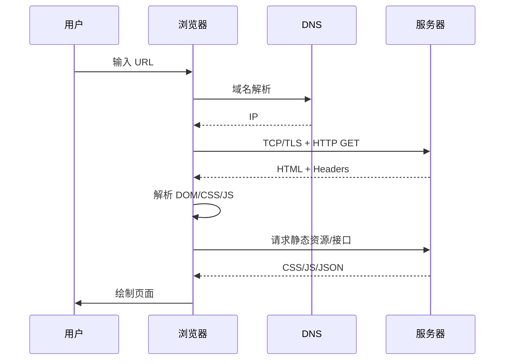

# 影石前端一面 · 参考答案（本次面经）

> 层次约定：**大题**用 `4.` `5.` … 与面经题号对齐；**题内分点**用 `（1）` `（2）` …  
> 面经第 1–3 题为自我介绍 / 项目亮点 / 主修课程，本文档不收录；第 9 题未出现在本次面经，亦不占位。

---

4. 代码题：一个 `fetch` 挖坑，为什么拿不到 `data`？

面试回答：

这类题通常是在 `fetch` 返回值上「看起来像 axios 一样直接 `.data`」，或者忘了把 **Response 体**解析成 JSON。

`fetch` 返回的是 **`Response` 对象**（浏览器对 HTTP 响应的封装），不是业务数据本身。常见坑有：

（1）**直接 `.data`**：`fetch` 的 `Response` 上没有 axios 那种 `data` 字段，应 `await response.json()` 或 `.text()`。

（2）**忘了 await 解析**：`response.json()` 本身也是 Promise，漏 `await` 拿到的是 pending 的 Promise，不是对象。

（3）**没检查 HTTP 状态**：`fetch` 只有网络失败才 reject；**4xx/5xx 仍会 resolve**，不判断 `response.ok` 就去 `json()`，可能解析到错误页 HTML。

（4）**重复读 body**：`response.body` 只能消费一次，先 `json()` 再 `text()` 会报错。

（5）**异步时序**：在 `.then` 链外同步读变量，数据还没回来。

正确写法示例：

```javascript
async function loadUser() {
  const response = await fetch('/api/user/1')
  if (!response.ok) {
    throw new Error(`HTTP ${response.status}`)
  }
  const data = await response.json() // 这里的 data 才是业务 JSON
  return data
}
```

若题目故意写成 `const { data } = await fetch(url)` 或 `fetch(url).data`，根因就是 **API 语义混淆**：axios 在拦截器里把 `response.data` 解包了，原生 `fetch` 没有这一层。

解析 / 要点：

```text
fetch(url)
  → Promise<Response>     // 不是业务 data
  → response.ok / status  // HTTP 层是否成功
  → response.json()       // 解析 body → 才是 JSON 对象
```

| 坑 | 现象 | 修复 |
| --- | --- | --- |
| 直接 `.data` | `undefined` | 用 `await res.json()` |
| 未 `await json()` | 得到 Promise | 补 `await` |
| 忽略 `response.ok` | 把错误当成功 | 先判状态再解析 |
| 与 axios 混用习惯 | 以为自动解包 | 封装统一 request 层 |

面试加分：提一句 **CORS 预检**——跨域失败时连 `Response` 都拿不到，Network 面板会是 failed，与「拿到 Response 但 json 为空」要区分。

---

5. 页面输入 URL 到内容显示，经历了什么过程？

面试回答：

可以按 **「找服务器 → 建连 → 要资源 → 浏览器渲染」** 四段讲。

**（1）URL 解析与导航**

- 浏览器解析 URL：协议、域名、端口、路径、query、hash。
- 若是外链或用户回车，触发 **导航**（navigation）；同一页仅改 hash 可能不重新请求文档（取决于 SPA 路由）。

**（2）DNS 与建立连接**

- **DNS** 把域名解析成 IP（浏览器缓存 → OS 缓存 → DNS 服务器）。
- **TCP 三次握手** 建立连接；HTTPS 还有 **TLS 握手**（证书校验、密钥协商）。

**（3）HTTP 请求与响应**

- 浏览器发 **HTTP 请求**（Method、Headers、Cookie 等）。
- 可能 **301/302 重定向**；服务器返回 HTML 及 **Cache-Control** 等缓存头。
- 浏览器按缓存策略决定用磁盘缓存还是重新请求。

**（4）解析与渲染（关键渲染路径）**

- **HTML 解析** → DOM 树；遇 `<link>`、`<script>` 等可能阻塞或并行加载。
- **CSS 解析** → CSSOM；DOM + CSSOM → **渲染树**（render tree）。
- **Layout（回流）**：计算几何位置；**Paint（绘制）**：填像素；**Composite（合成）**：图层合成上屏。
- **JS 执行**：可能改 DOM/CSS，触发重排重绘；现代浏览器会 **DOMContentLoaded**、**load** 分阶段触发。
- 页面引用的 **JS/CSS/图片/字体** 等继续并发请求（HTTP/2 多路复用），递归上述过程。

若是 **SPA**（单页应用），首屏往往只下到 `index.html` + bundle，后续路由切换由前端 **History API / hash** 改 URL，再 **XHR/fetch** 拉 JSON，局部更新 DOM，不再整页刷新。

解析 / 要点：

```text
输入 URL → DNS → TCP (+TLS) → HTTP 请求
    → 响应 HTML → 解析 DOM
    → 加载 CSS/JS → 渲染树 → Layout → Paint → Composite → 屏幕显示
    → 子资源并行加载（图片、接口…）
```

| 阶段 | 常考关键词 |
| --- | --- |
| 网络 | DNS、TCP 三次握手、TLS、CDN |
| HTTP | 缓存（强缓存/协商缓存）、Cookie、重定向 |
| 渲染 | DOM、CSSOM、FOUC、阻塞脚本 |
| 优化 | 预连接、preload、defer/async、关键 CSS |



---

6. HTTP 响应报文的具体内容是什么？

面试回答：

HTTP 响应报文分 **起始行、首部行、空行、消息体** 四部分，文本格式（HTTP/1.x）大致如下：

```http
HTTP/1.1 200 OK
Date: Mon, 01 Jun 2026 08:00:00 GMT
Content-Type: application/json; charset=utf-8
Content-Length: 57
Cache-Control: no-cache
Set-Cookie: session_id=abc; Path=/; HttpOnly
Connection: keep-alive

{"code":0,"message":"ok","data":{"name":"demo"}}
```

**（1）起始行（Status Line）**

- 协议版本：`HTTP/1.1` 或 `HTTP/2`
- **状态码**：如 `200`、`404`、`500`
- **原因短语**：如 `OK`、`Not Found`（HTTP/2 可省略，但逻辑仍在）

**（2）响应头（Response Headers）**

- **Content-Type**：body 类型，如 `text/html`、`application/json`
- **Content-Length** 或 **Transfer-Encoding: chunked**：body 长度或分块传输
- **Cache-Control / ETag / Last-Modified**：缓存控制
- **Set-Cookie**：服务端种 Cookie
- **Location**：重定向目标（3xx）
- **Access-Control-Allow-Origin**：CORS 相关
- 自定义头：如 `X-Request-Id`

**（3）空行**

- `\r\n`，分隔头与 body

**（4）消息体（Body）**

- HTML 页面、JSON、图片二进制等；HEAD 请求时无 body
- **204 No Content**、**304 Not Modified** 等通常无 body 或 body 为空

HTTP/2 在帧层传输，但语义仍是「状态 + 头 + 体」；面试答 HTTP/1.1 文本示例即可，可补一句 HTTP/2 头压缩（HPACK）、多路复用。

解析 / 要点：

```text
┌─────────────────────────────────────┐
│ 起始行   HTTP/1.1 200 OK            │
├─────────────────────────────────────┤
│ 响应头   Content-Type: ...          │
│         Set-Cookie: ...             │
├─────────────────────────────────────┤
│ 空行                                │
├─────────────────────────────────────┤
│ 消息体   { "data": ... }            │
└─────────────────────────────────────┘
```

| 部分 | 作用 |
| --- | --- |
| 状态码 | 结果类别，给程序分支判断 |
| Content-Type | 告诉浏览器如何解析 body |
| Cache-Control | 是否缓存、缓存多久 |
| Set-Cookie | 会话、登录态 |

与第 4 题衔接：`fetch` 拿到的 `Response.headers` 是 Headers 对象，`response.json()` 读的是**消息体**部分。

---

7. 元素水平居中的方式有哪些？

面试回答：

分场景：**行内内容**、**块级固定宽度**、**未知宽度**、**Flex/Grid 布局**。

**（1）行内 / 文本：`text-align: center`**

- 作用于**父元素**，让内部 inline / inline-block / 文字居中。

**（2）块级定宽：`margin: 0 auto`**

- 元素设 `width`（或 max-width），左右 `auto` 均分剩余空间。
- 需要 **display: block**（默认 div 即可），且不能 float。

**（3）Flex：`display: flex; justify-content: center`**

- 父容器 Flex，主轴水平居中；子项还可 `align-items: center` 做垂直。
- 现代布局首选，适配响应式。

**（4）Grid：`display: grid; justify-items: center` 或 `place-items: center`**

- 二维居中一行代码，适合卡片网格里单个居中。

**（5）绝对定位 + transform**

```css
.parent { position: relative; }
.child {
  position: absolute;
  left: 50%;
  transform: translateX(-50%);
}
```

- 适合宽高未知或浮层；垂直也可 `top: 50%; translate(-50%, -50%)`。

**（6）`margin-inline: auto`（逻辑属性）**

- 与 `margin: 0 auto` 类似，适配 RTL。

面试建议：**先说父元素还是子元素居中，再说是否知道宽度**——面试官要的是场景判断，不是背八套 API。

解析 / 要点：

| 场景 | 推荐 |
| --- | --- |
| 一行文字 | `text-align: center` |
| 固定宽 div | `margin: 0 auto` |
| 导航栏多个 item | Flex `justify-content: center` |
| 弹窗未知宽高 | absolute + transform |
| 整页主内容区 | Flex/Grid + max-width |

```css
/* Flex 最常见写法 */
.container {
  display: flex;
  justify-content: center; /* 水平 */
  align-items: center;     /* 垂直，可选 */
}
```

注意：`text-align` 对 block 子元素本身无效；`margin: auto` 对未设宽度的 block 无效（宽度占满一行无可分配 auto）。

---

8. HTTP 状态码：5 个种类，以及常见状态码

面试回答：

HTTP 状态码按**首位数字**分 **5 类**：

| 类别 | 范围 | 含义 |
| --- | --- | --- |
| 1xx | 100–199 | **信息性**：请求已收到，继续处理 |
| 2xx | 200–299 | **成功**：请求已成功被接收、理解、接受 |
| 3xx | 300–399 | **重定向**：需要进一步操作以完成请求 |
| 4xx | 400–499 | **客户端错误**：请求有误或无法完成 |
| 5xx | 500–599 | **服务端错误**：服务器处理失败 |

**常见状态码**（建议背这些）：

**2xx**

- **200 OK**：成功，一般 GET/PUT 正常返回
- **201 Created**：创建成功，常配合 POST
- **204 No Content**：成功但无 body，如 DELETE 成功

**3xx**

- **301 Moved Permanently**：永久重定向，SEO 权重迁移
- **302 Found**：临时重定向
- **304 Not Modified**：协商缓存命中，用本地缓存

**4xx**

- **400 Bad Request**：参数非法、body 格式错
- **401 Unauthorized**：未认证（缺 Token / 登录过期）
- **403 Forbidden**：已认证但无权限
- **404 Not Found**：资源不存在
- **405 Method Not Allowed**：GET/POST 用错
- **409 Conflict**：冲突，如重复创建
- **429 Too Many Requests**：限流

**5xx**

- **500 Internal Server Error**：服务端未捕获异常
- **502 Bad Gateway**：网关上游挂了
- **503 Service Unavailable**：过载或维护
- **504 Gateway Timeout**：网关等上游超时

**1xx**（了解即可）

- **100 Continue**：大 body 上传前询问是否继续

前端联调时：**401 跳登录、403 提示无权限、404 资源不存在、5xx 统一友好错误页**；与第 4 题结合——`fetch` 不会因 404 reject，必须看 `response.status`。

解析 / 要点：

```text
2xx → 成功
3xx → 去别的 URL（或 304 用缓存）
4xx → 客户端改请求
5xx → 服务端修 bug / 扩容
```

记忆技巧：**4 开头找自己（参数、权限）**，**5 开头找后端**。

---

10. LLM 应用里的状态管理是怎么做的？

面试回答：

LLM（Large Language Model，大语言模型）应用的「状态」和普通 CRUD 页面不同，核心是 **对话上下文 + 工具执行态 + 会话元数据**，我会分四层讲：

**（1）对话消息态（最核心）**

- 维护 **messages 数组**：`system` / `user` / `assistant` / `tool` 角色。
- 每条带 `content`、时间戳、可选 **token 计数**、引用来源（RAG chunk id）。
- 前端：Pinia / Zustand / React state；持久化到 **localStorage** 或服务端 **sessionId** 关联的 DB。

**（2）系统与业务配置态**

- **System Prompt**（系统提示词）、模型名、temperature、max_tokens。
- 用户侧选项：反馈风格、题组 id、资料章节——对应 OfferPilot 类产品的 `sessionConfig`。
- 与消息态分离：**配置变不应污染历史消息**，除非显式「新会话」。

**（3）流式与进行态（transient state）**

- **Streaming**：`isStreaming`、`abortController`、当前 assistant 消息的 **displayContent**（增量 buffer）。
- **Tool Calling**：pending tool、tool 结果回填 messages。
- 这类态一般 **不落库**，结束流式后合并进 assistant 最终一条。

**（4）服务端会话态**

- **sessionId / threadId** 映射到 Redis/DB，存完整 messages 或压缩摘要。
- 多轮对话靠 **服务端权威历史** 或客户端带 `history[]` POST（注意长度与鉴权）。

**状态变更原则**（可主动提，显工程化）：

- **单一事实来源**：消息列表只在一处 append，SSE chunk 只走一个 queue。
- **派生用 computed**：如「是否可发送 = !isStreaming && input.trim()」。
- **清空边界**：新会话、切场景、登出时明确清哪些（消息 vs 配置 vs 缓存）。

解析 / 要点：

```text
┌─────────────────────────────────────────┐
│ 配置态：model / systemPrompt / 题组 id   │
├─────────────────────────────────────────┤
│ 消息态：messages[]（持久化）             │
├─────────────────────────────────────────┤
│ 流式态：buffer / isStreaming（临时）     │
├─────────────────────────────────────────┤
│ 工具态：tool_calls / 检索结果（回合内）  │
└─────────────────────────────────────────┘
```

| 状态类型 | 存哪 | 示例 |
| --- | --- | --- |
| 历史消息 | DB / localStorage | 多轮问答 |
| 流式 buffer | 内存 | SSE chunk 拼接 |
| 会话配置 | session 存储 | 入口模式、难度 |
| UI 折叠 | 组件内 | 侧边栏开闭 |

与 Vue 对比：**LLM 状态 = 消息列表 + 异步流式副作用**，类似聊天室 + 下载进度，不是简单表单 model。

---

11. 内容超出上下文（Context）限制怎么办？按优先级压缩

面试回答：

模型有 **Context Window**（上下文窗口，如 8K / 128K tokens），超出会截断或报错。工程上按 **「保留什么比丢什么更重要」** 做**优先级压缩**：

**优先级从高到低**（建议这样答）：

**（1）System Prompt 与硬约束（最高，尽量完整保留）**

- 角色、安全规则、输出格式（JSON schema）、「仅依据引用回答」——压缩会导致行为漂移，**原则上不删**，最多做结构化精简。

**（2）当前用户意图与最近 1–2 轮对话（高）**

- 用户刚问的问题、上一轮澄清；**多轮指代**（「它」「上面那个」）依赖近轮，优先保留。

**（3）RAG / Tool 检索结果（中高，可裁剪）**

- 按相关性 **TopK 降 K**，或 **重排序后截断**每条 chunk 长度。
- 长文只保留 **摘要 + 引用 id**，详情按需二次检索（Agentic RAG）。

**（4）更早的历史对话（中，可摘要）**

- **Rolling Summary**：用模型或规则把旧轮合并成一段 **summary message**，替换原始多轮。
- 或 **滑动窗口**：只留最近 N 轮，N 由 token 预算动态算。

**（5）Assistant 长回复（中低）**

- 旧 assistant 全文可 **摘要**；用户更关心结论与代码块时可保留 code block、删解释性废话。

**（6）Tool 原始输出 / 日志（低）**

- 调试 JSON、HTTP 全量 body 最先删，只留 **结论字段**。

**落地手段**：

- 上传前 **tiktoken** 估 token；超阈值触发压缩 pipeline。
- **Map-Reduce**：长文档分块各自摘要再合并（适合全书型资料）。
- **缓存 KV**（部分 API 支持 prompt caching）把固定 system 放缓存层。

解析 / 要点：

```text
Token 预算分配示例（128K 窗口）：
  System + 格式约束     ~2K   （固定）
  最近对话               ~20K  （优先）
  RAG 检索               ~30K  （可调 TopK）
  历史摘要               ~10K  （替代原 50K 历史）
  生成预留               ~8K   （给模型输出）
```

| 策略 | 适用 |
| --- | --- |
| 滑动窗口 | 闲聊、轮数不多 |
| 摘要压缩 | 长咨询、客服 |
| RAG 减 K | 资料问答 |
| 分层存储 | 详情进 DB，上下文只放 id |

面试加分：提 **「丢前问用户能否开新会话」** 比静默截断体验更好；OfferPilot 类场景 **entryMode + sessionConfigKey** 不一致导致的「串台」本质也是上下文管理问题。

---

12. Git：一套完整的推送流程（常用命令）

面试回答：

从本地改代码到远程仓库，完整流程可以这样说：

**（1）查看状态**

```bash
git status          # 工作区 / 暂存区变更
git diff            # 未暂存的改动
git diff --staged   # 已暂存、待提交的改动
```

**（2）拉取最新（协作前习惯）**

```bash
git pull origin main
# 或分步：git fetch origin && git merge origin/main
# 功能分支常用：git pull --rebase origin main
```

**（3）暂存与提交**

```bash
git add <file>      # 或 git add . 谨慎使用
git commit -m "feat: 具体中文说明"
```

**（4）推送到远程**

```bash
# 首次推送当前分支
git push -u origin feature/xxx

# 之后
git push
```

**（5）走 Pull Request 流程（团队常见）**

```bash
git checkout -b feature/xxx   # 从 main 拉功能分支
# ... 开发、commit ...
git push -u origin feature/xxx
# 在 GitHub/GitLab 开 PR → Code Review → 合并到 main
```

**常用辅助命令**：

```bash
git log --oneline -10    # 最近提交
git branch -vv           # 本地分支跟踪关系
git stash / git stash pop  # 临时存改动
git restore <file>       # 丢弃工作区修改
git commit --amend       # 改最后一次提交（未推送时）
```

我会强调：**push 前 pull/rebase 减少冲突**；**不 force push 到 main**；提交信息用团队规范（`feat`/`fix`/`docs` + 中文描述）。

解析 / 要点：

```text
工作区 → git add → 暂存区 → git commit → 本地仓库 → git push → 远程仓库
                     ↑
              git pull / fetch 同步他人提交
```

| 命令 | 作用 |
| --- | --- |
| `git status` | 看改了啥 |
| `git add` | 选进暂存区 |
| `git commit` | 本地快照 |
| `git push` | 上传到 remote |
| `git pull` | 拉取并合并 |

冲突处理：`git pull` 冲突 → 手改文件 → `git add` → `git commit`（或 rebase 后继续 `git rebase --continue`）。

---

13. 什么是 API？

面试回答：

**API**（Application Programming Interface，应用程序编程接口）是**一套约定好的调用方式**，让不同模块、不同服务之间能互相使用能力，而不用关心内部实现细节。

可以分三个层次理解：

**（1）广义 API**

- 任何「对外暴露的接口」：JS 里的 `Array.map`、浏览器 `document.querySelector`、操作系统文件 API，都是 API。

**（2）Web API / HTTP API（前端面试常指这个）**

- 通过 **HTTP** 访问：**URL + Method（GET/POST/…）+ Headers + Body**。
- 服务端返回 **JSON/XML** 等；前端用 `fetch`、axios 调用。
- 例：`GET /api/users/1` 返回用户 JSON。

**（3）API 的设计要素**

- **契约**：路径、参数、响应字段、错误码（可与 OpenAPI/Swagger 文档对齐）。
- **鉴权**：API Key、JWT Bearer Token、Cookie Session。
- **版本**：`/api/v1/...`
- **限流与幂等**：POST 创建 vs PUT 幂等更新。

和 **SDK** 区别：API 是协议层约定；SDK 是某语言封装的客户端库，内部还是调 HTTP API。

前后端分离项目里：**后端暴露 RESTful API，前端只调 API 渲染页面**，这就是通过 API 协作。

解析 / 要点：

```text
前端 ──HTTP(JSON)──► API 网关 / 后端 ──► 数据库 / LLM / 存储
      ◄──响应────────
```

| 术语 | 含义 |
| --- | --- |
| REST | 用 HTTP 动词操作资源 |
| Endpoint | 具体 URL 路径 |
| DTO | 数据传输对象，前后端字段对齐 |
| GraphQL | 另一种 API 查询风格，单端点 |

---

14. 如何实现：点击切换按钮切换主题为深色模式？

面试回答：

前端深色模式常见有 **三套信号**：用户手动选择、**localStorage** 记忆、**prefers-color-scheme** 跟随系统。完整实现：

**（1）CSS 变量定义主题**

```css
:root {
  --bg: #ffffff;
  --text: #1a1a1a;
}
html.dark {
  --bg: #121212;
  --text: #e8e8e8;
}
body {
  background: var(--bg);
  color: var(--text);
}
```

**（2）切换逻辑（Vanilla JS）**

```javascript
const KEY = 'theme'
const root = document.documentElement

function applyTheme(mode) {
  root.classList.toggle('dark', mode === 'dark')
  localStorage.setItem(KEY, mode)
}

function initTheme() {
  const saved = localStorage.getItem(KEY)
  const prefersDark = window.matchMedia('(prefers-color-scheme: dark)').matches
  applyTheme(saved ?? (prefersDark ? 'dark' : 'light'))
}

document.getElementById('toggle').addEventListener('click', () => {
  const isDark = root.classList.contains('dark')
  applyTheme(isDark ? 'light' : 'dark')
})

initTheme()
```

**（3）Vue / React 项目**

- 全局 store 存 `theme: 'light' | 'dark' | 'system'`。
- 在 **`index.html` 或根组件** 最早时刻设 `class`，避免 **FOUC**（Flash of Unstyled Content，主题闪一下）。
- Naive UI / Element Plus 等组件库常提供 **darkTheme** 配置，要和 CSS 变量联动。

**（4）可选增强**

- 监听 `matchMedia('(prefers-color-scheme: dark)').addEventListener('change')`，system 模式下跟随 OS。
- 用 **`color-scheme: dark`** meta/CSS 告诉浏览器滚动条、表单原生控件也走深色。

解析 / 要点：

```text
优先级建议：用户手动 > localStorage > 系统 prefers-color-scheme
切换本质：html/body 上的 class 或 data-theme → CSS 变量换色
```

| 方式 | 优点 | 注意 |
| --- | --- | --- |
| class on html | 简单、兼容好 | 最早注入防闪烁 |
| data-theme | 语义清晰 | 选择器 `[data-theme=dark]` |
| CSS only @media | 无 JS | 无法手动 override 除非 :has |

组件库场景：除页面背景，还要 **切换 Provider 的 theme 对象**，否则按钮、输入框仍是浅色。

---

15. AI 工具会取代程序员吗？

面试回答：

我的观点是：**AI 会显著改变程序员的工作内容，但不会在中短期内完全取代「对业务负责的人」**。

**（1）AI 已经替代的是「片段劳动」**

- 样板代码、单元测试初稿、正则、CRUD、文档——这些本来就可自动化，AI 加速而已。

**（2）取代不了的核心能力**

- **需求澄清与取舍**：产品没说清的边界、性能与安全 trade-off，要人拍板。
- **系统设计与 accountability**：架构、模块边界、线上故障谁负责——AI 不能背锅。
- **跨团队契约**：API、SSE 事件、与 C++ 并行时的接口对齐，需要沟通与版本治理。
- **质量与安全**：鉴权、XSS、Prompt 注入、数据隐私，必须 human review。
- **复杂调试**：流式渲染卡顿、session 串台、弱网重试——要懂全链路。

**（3）程序员角色在迁移**

- 从「手写每一行」→ **「问题拆解 + AI 协作 + 审查 + 集成」**。
- 影石这类看重 AI 的公司，招的是 **会用 AI 放大产出、且能判断对错** 的人，不是不用 AI 的码农，也不是盲信 AI 的复制粘贴者。

**（4）我的实践态度**

- 任务拆成：**上下文清晰的子任务** → AI 出初稿 → 人做规范对齐、测试、边界 case。
- 简单代码交给 AI，**核心状态机、协议、安全** 自己主导。

结论：**程序员数量可能重组，但「工程师 + AI」会比纯 AI 或纯手工都强**；被取代的是拒绝工具、又不做深度思考的那部分重复劳动。

解析 / 要点：

| 维度 | AI | 人 |
| --- | --- | --- |
| 生成速度 | 极快 | 慢 |
| 业务理解 | 浅、易幻觉 | 可追责 |
| 架构 | 易过度设计或漏边界 | 长期维护 |
| 协作 | 无 | 产品/后端/测试 |

面试态度：**既不傲慢「AI 无用」，也不投降「全靠 AI」**——展示你真实用 AI 提效的案例（任务拆解、review 清单）最加分。

---

16. 反问：公司现在的项目背景？如果有幸入职，目前的主要任务是什么？

面试回答：

这是**反问环节**，没有标准答案，但要问得**具体、可执行**，体现你真的想来而不是套话。可以参考这样组织：

**（1）项目背景（了解业务）**

- 请问团队目前在做的**核心产品**是哪一条线？主要是 **ToC 设备配套 Web**、**内部工具**，还是 **AI 相关的新业务**？
- 前端技术栈是 **Vue / React** 为主，还是多端（Web + 小程序 + 桌面）？是否有**遗留系统**需要维护？
- 产品用户量级和性能要求大概怎样？有没有 **国际化、低性能设备** 等特殊约束？

**（2）入职主要任务（了解角色）**

- 如果我有幸加入，**前 3–6 个月**更期望我负责 **新功能开发、性能优化、还是 AI 能力接入**？
- 团队里前端与 **算法 / 后端 / 设计** 的分工是怎样的？联调频率如何？
- 目前最大的**技术痛点或 backlog** 是什么？（例如 legacy 重构、监控、CI、组件库）

**（3）结合面里聊过的 AI（若已强调 AI 能力）**

- 公司希望工程师 daily 用 AI 到哪个程度？有没有内部的 **Prompt 规范、代码 review 对 AI 生成码的要求**？
- 是否有 **Agent、RAG、MCP** 等已在产品里落地，还是探索阶段？

**（4）团队与成长**

- 团队规模、mentor 机制、code review 文化？
- 对这个岗位，**最看重的前两三项能力**是什么？（验证与 JD 是否一致）

语气：**真诚、简洁**，问 2–3 个最有答案价值的问题即可，留给面试官发挥空间。

解析 / 要点：

```text
好的反问 = 业务理解 + 角色预期 + 技术栈匹配 + 成长路径
避免：只问加班、只问薪资（若已在别轮聊过）、空泛「贵司文化怎样」
```

| 问题类型 | 目的 |
| --- | --- |
| 产品与用户 | 判断业务稳定性与复杂度 |
| 前半年任务 | 对齐预期，减少入职落差 |
| AI 工程化 | 匹配面里强调的 AI 权重 |
| 团队流程 | 评估协作成本 |

面经补充：本次还聊了**薪资**与 **AI 使用**、**任务拆解如何喂给 AI**——可在自我介绍或第 15 题延伸时主动举例，反问不必重复薪资，除非 HR 轮未谈清。

---

## 附录：面里延伸 — 任务拆解怎么喂给 AI

> 非独立题号，供第 15 题与项目追问备用。

面试回答：

我拆任务给 AI 会遵循 **「边界清晰、上下文自足、可验证」**：

（1）**先写清目标与约束**：改哪条路由、不能动哪些目录、技术栈版本、验收标准（如「刷新不串 session」）。

（2）**拆成可并行的小步**：例如「只读探索代码库 → 改 composable → 改展示组件 → 自测清单」，每步单独开对话或 subagent，避免一次 prompt 塞整个需求。

（3）**附带真实类型与路径**：`@文件路径`、接口 DTO、错误截图——减少 AI 猜字段。

（4）**明确输出格式**：要 patch 还是完整函数、要不要解释、测试命令 `pnpm lint`。

（5）**人做 gate**：AI 产出后必跑 lint/手动测关键路径，**协议层与安全** 自己终审。

解析 / 要点：

```text
大需求 → 子任务（输入/输出/禁止项）→ AI 执行 → 人 review & 测试 → 合入
```

这与影石「十分看重 AI 使用能力」的考察点直接对齐。

---

文档说明：大题编号与本次面经对齐（4–8、10–16）；1–3 为自我介绍 / 项目 / 课程，9 未考，均不占位。
